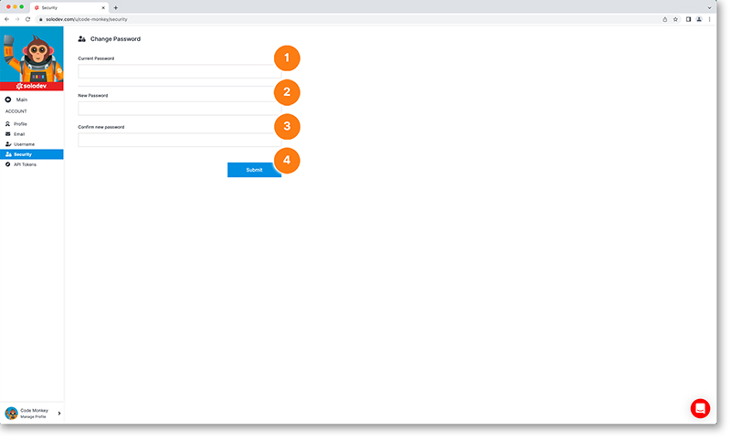

# Change Password

To change the password associated with your account:

1. Enter your password in the current password box
2. Enter your new password in the new password box
3. Re-enter your new password in the confirm new password box
4. Click the submit button to update your password (an alert will appear in the bottom lefthand corner of the screen to notify you the password change is successful)

!!!
***Note:** Passwords must be at least 8 characters long including one uppercase letter, one special character and alphanumeric characters.*
!!!

