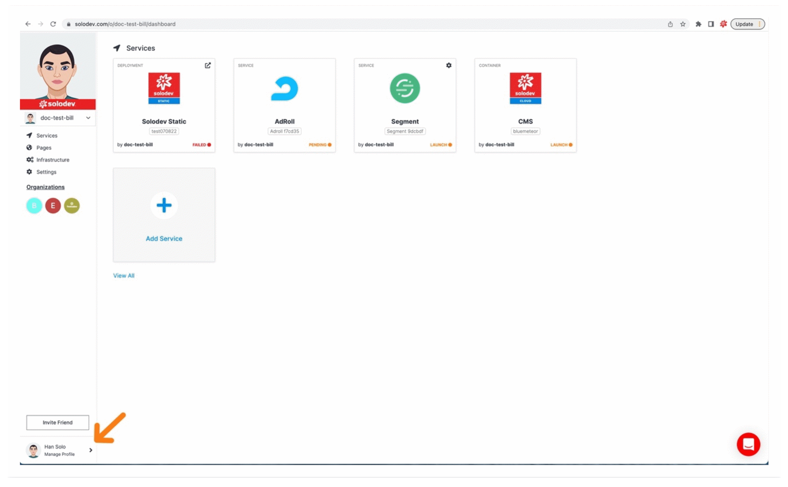
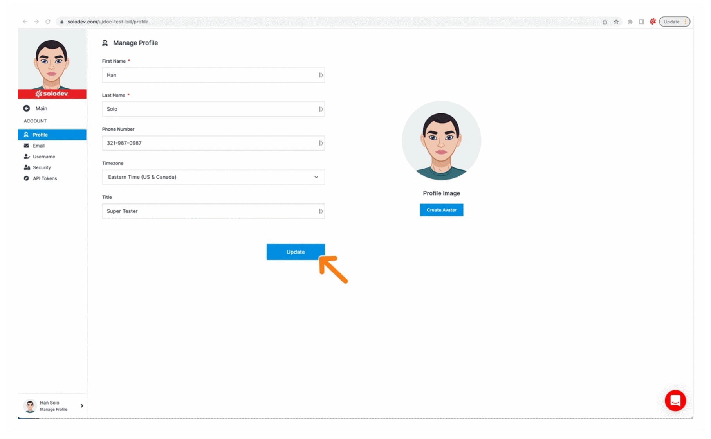
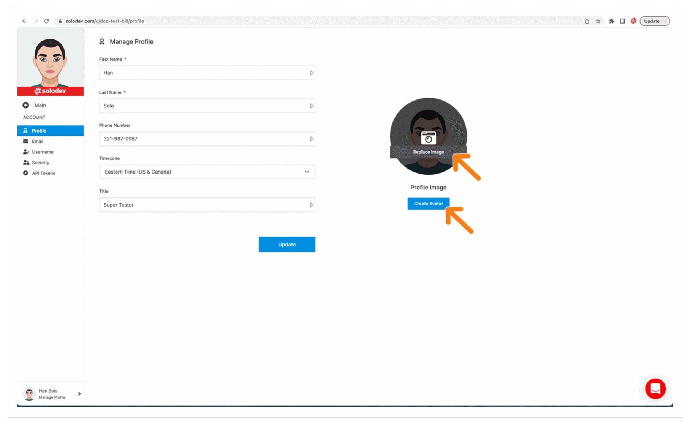

# Developer Profile

Set up your developer profile to establish your custom user image/avatar, name, phone number, time zone and title.

---

## Access your developer profile

- To access your profile, click the arrow next to your username at the bottom left of the Solodev dashboard
- In the modal window click My Profile to bring up your manage profile page

---

## Manage profile

- Populate the respective fields (First Name and Last Name are required fields).
- Click Update.
- An alert appears in the bottom lefthand corner of the dashboard to notify you the update is successful.

---

## Change your profile image 

There are two ways to update your profile image. You can choose to upload an image or you can create a custom Avatar with the Ready Player Me avatar generator. Either way, customizing your image will help you to identify among other users, organizations and in the marketplace.

**Option 1—Upload an Image:**

- Click the Profile Image to bring up the camera icon and the Replace Image label
- Click Replace Image
- Find and choose your image (*image should be 0000px x 0000px?*) and click open
- An alert appears in the bottom lefthand corner of the dashboard to notify you the image replacement is successful and your image will now display at the top left of your workspace

**Option 2—Generate Avatar:**

- Click the blue generate avatar button to bring out the modal on the right
- Sign-up or login to Ready Player Me or continue as a guest
- Follow the steps in customizing your avatar (after the last step it takes a few seconds to generate and apply your new avatar)
- An alert appears in the bottom lefthand corner of the dashboard to notify you the image replacement is successful and your image will now display at the top left of your workspace

