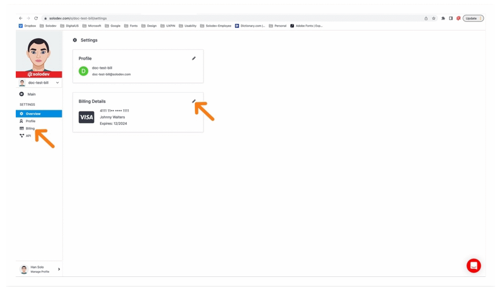
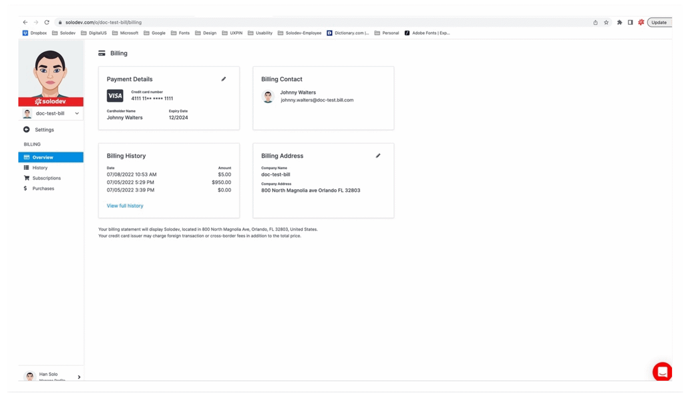
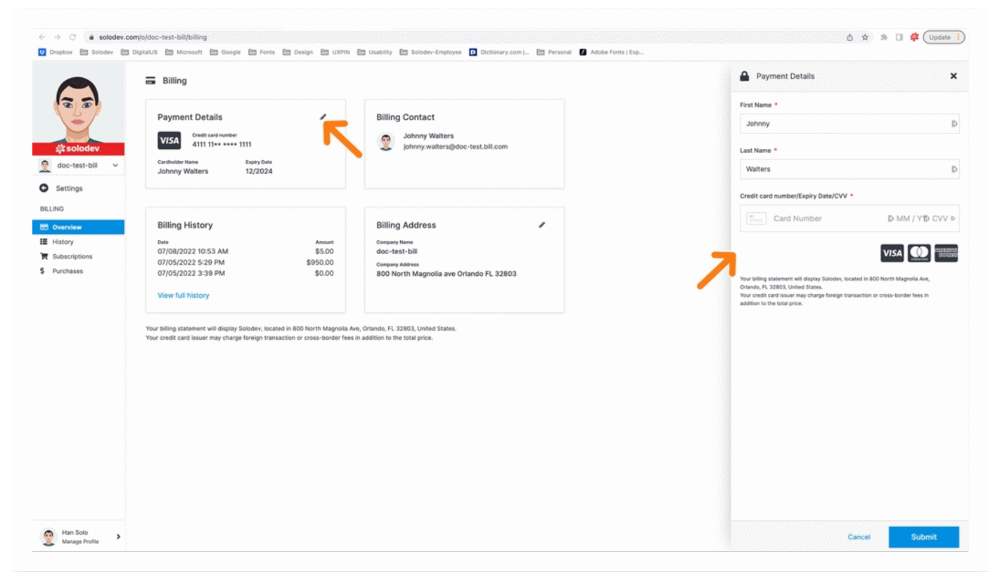
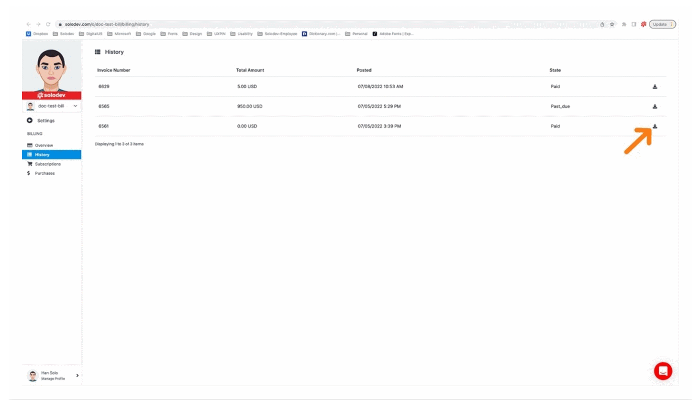

# Developer Settings

Set up your developer settings to establish basics like billing/payment details and to manage your subscriptions and purchases. 

---
## Access your developer settings

You can access your developer settings from your home dashboard by clicking on the settings option in the main-left nav

----

- Your settings home screen will allow you access to your billing details via the card on the right or the billing menu item in the left nav

----

---
## Billing

Your billing page allows access to:
- Your payment details
- Your billing contact
- Your billing history
- Your billing address
- Your subscriptions (via left nav)
- Your purchases (via left nav)

----

### Payment details

You can update your payment credit card by clicking on the pencil icon in the top corner of the payment details card to open the details modal on the right. Once you make your necessary changes hit the blue submit button on the bottom right.

----

### Billing history

You can view your billing history by selecting the history option in the left nav or clicking on the “view full history” link in the card.

----

Your complete billing history will be listed here with the ability to download an invoice in the last column on the right.

----

### Billing address

You can update your billing address by clicking on the pencil icon in the top corner of the billing address card to open the details modal on the right. Once you make your necessary changes hit the blue submit button on the bottom right.

----

### Subscriptions

You can review your subscriptions by clicking on the main nav option. This will show you all of your subscriptions in card format in the workspace. You can filter by status with the drop down option at your top right. Clicking on the card itself will open the subscription detail.

----

Clicking on the card takes you directly to that subscription. Details of this screen will be covered in the services section of the documentation.

----

### Purchases

You can review your purchases by clicking on the main nav option. This will show you all of your purchases in card format in the workspace. You can filter by status with the drop down option at your top right. Clicking on the card itself will take you to the appropriate screen depending on item type and status.

----
