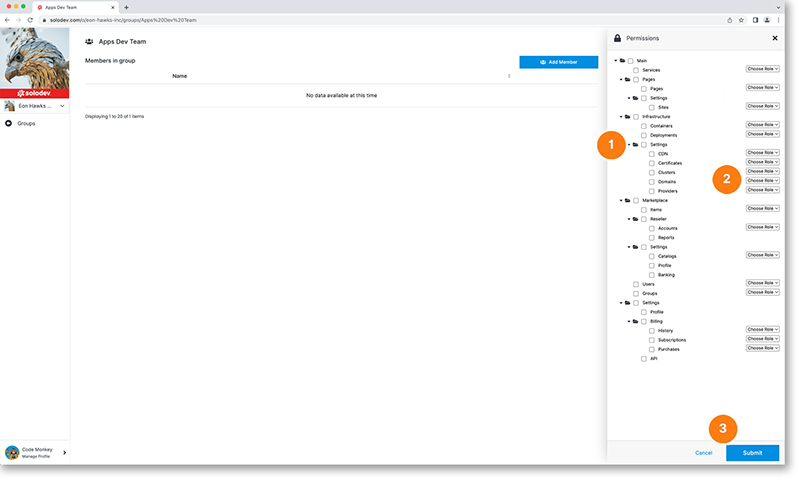

# Permissions

You can take advantage of the robust permissions management system built in to Solodev cloud to specify actions and resources available to certain groups. Specifying group actions determines what each member of the group will see on their Solodev Cloud dashboard. For example, developers can create an accounting group where each user has access to settings and billing, while prohibiting access to Websites, Infrastructure, Users or Groups. 

Expand each folder to add permissions to only parts of section. Every selection item has three permissions to choose from:
   
- View, which will allow users in the group to only see content
- Edit, which will allow users in the group to modify content
- Admin, which will allow users in the group full access to

Once you have configured all your settings, click the blue submit button at the bottom right of the modal to apply them to your group.

!!!
***Please note:***
    
- *Selecting the main checkbox at the top will select all check boxes below*
- *Selecting the checkbox at the folder level will select all check boxes in that folder*
- *By leaving the default “Choose Role” and not selecting an option, users in the group will not be able to view that section*
!!!

