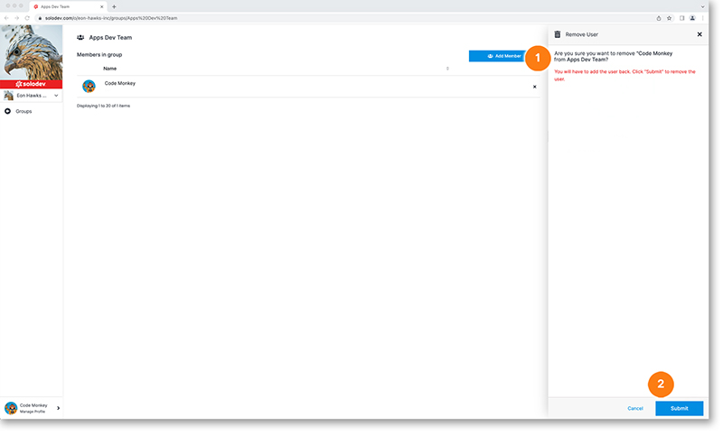

# Remove Member

To remove a user from a group, go to that group’s home page. From there, find the user you’d like to delete and hit the X to the right of their row. This will bring up the warning module confirming you’d like to remove. To remove the user hit the blue submit button in the bottom right of the modal.

