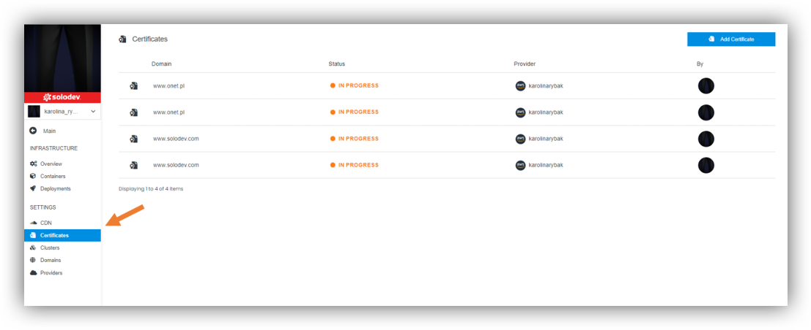
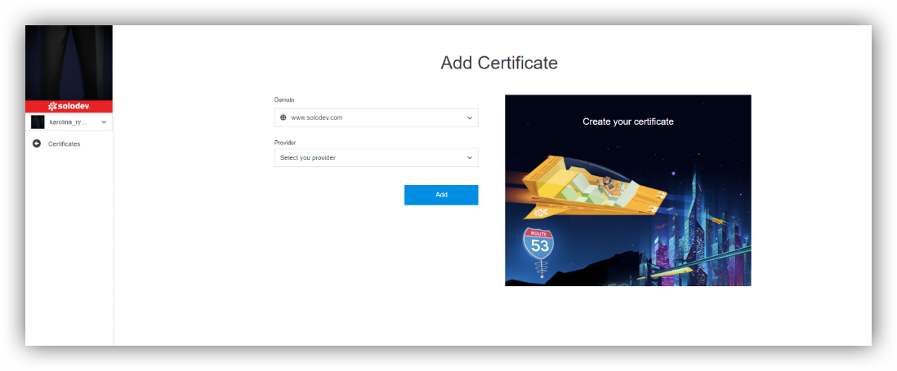

# Certificates

## About Certificates

Website security certificate is a digital stamp of approval from an industry-trusted third party known as a certificate authority (CA). More specifically, it’s a digital file containing information that’s issued by a CA that indicates that the website is secured using an encrypted connection.

With a website security certificate, users can be confident that connection is made to the right, official server for the website that he wants to visit (not fake one). Moreover nobody can intercept data they send to the website and use it for nefarious purposes.

## Adding Certificates

In section Infrastructure, Certificates is part of Settings in the left side of the page. Click on that.
There you have certificates list and option “Add Certificate”.

----

If you would like to add CDN, you will be asked to:
- Select domain. You can take the existing one or create new one by clicking “Add Domain”.
- Select provider. You can take the existing one or create new one by clicking “Add Provider”.
- Click Add.

----