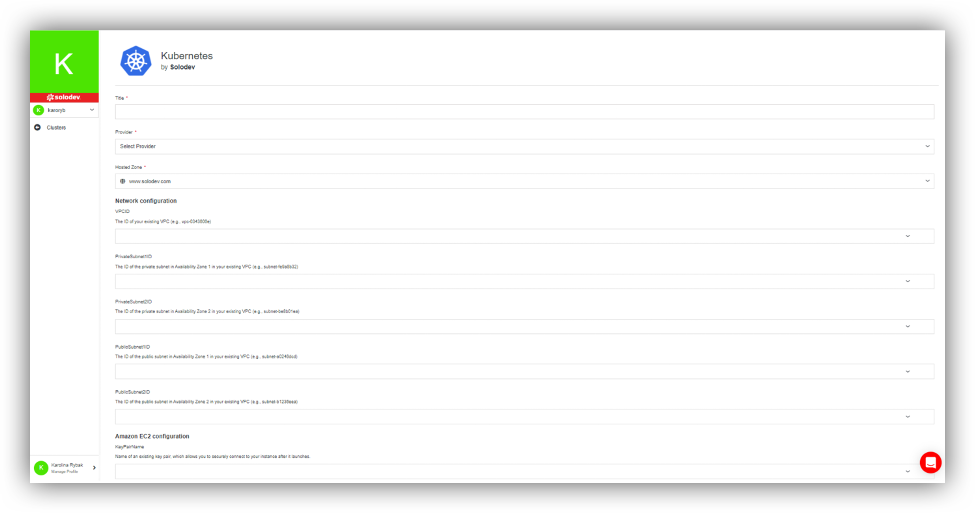
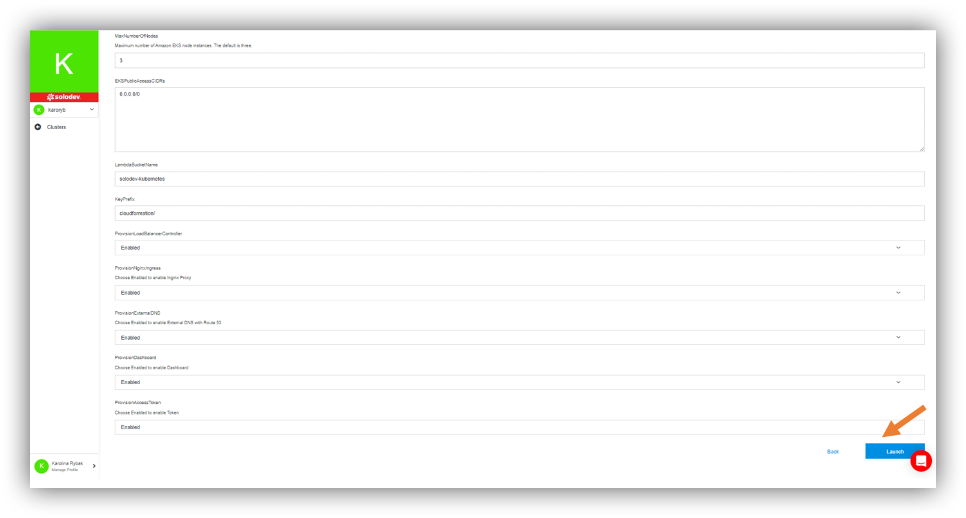

## About Clusters

Cluster is a set of nodes that run containerized applications. Containerizing applications packages an app with its dependences and some necessary services. They are more lightweight and flexible than virtual machines.

A cluster can contain many pods, related or unrelated [and] grouped under the tight logical borders called namespaces.

---

## About Kubernetes
Kubernetes is open-source software that allows you to deploy and manage containerized applications at scale. Kubernetes manages clusters of Amazon Elastic Compute Cloud (EC2) compute instances and runs containers on those instances with processes for deployment, maintenance, and scaling. Using Kubernetes, you can run any type of containerized applications using the same toolset on-premises and in the cloud.

AWS makes it easy to run Kubernetes in the cloud with scalable and highly available virtual machine infrastructure, community-backed service integrations, and Amazon Elastic Kubernetes Service (EKS), a certified conformant, managed Kubernetes service.
Kubernetes works by managing a cluster of compute instances and scheduling containers to run on the cluster based on the available compute resources and the resource requirements of each container. Containers are run in logical groupings called pods and you can run and scale one or many containers together as a pod.
Kubernetes control plane software decides when and where to run your pods, manages traffic routing, and scales your pods based on utilization or other metrics that you define. Kubernetes automatically starts pods on your cluster based on their resource requirements and automatically restarts pods if they or the instances they are running on fail. Each pod is given an IP address and a single DNS name, which Kubernetes uses to connect your services with each other and external traffic.

Product options:
- Large Cluster (2.450 $/ month) - For AWS Large Kubernetes Cluster Deployment.
- XLarge Cluster (4.450 $/ month) - For AWS XLarge Kubernetes Cluster Deployment.
- 2XLarge Cluster (8.450 $/ month) - For AWS 2XLarge Kubernetes Cluster Deployment.

---

## Adding Clusters

In section Infrastructure, Clusters are part of Settings in the left side of the page. Click on that.

There you have an option “Add Cluster”. On the right you have also the button “Providers”, where you can choose your provider or add another one.

If you would like to add cluster, you should:

- Choose “Add Cluster”.
- Click “Buy Now”.
- Choose product option ([please see](#about-kubernetes)).
- Choose add-ons (Additional Node, 1.375 $/ month), if needed.
- Click “Install”.

- Enter the Title.
- Select provider. You can take the existing one or create new one by clicking “Add Provider”.
- Choose Hosted Zone. You can take the existing one or create new one by clicking “Add Domain”.

- Click launch.

After launching your cluster, you will manage it, inter alia by adding containers. You can also use the 2 options on the right (“Update” and peak pointing downward). -> Please see more in the section “Managing deployments”.