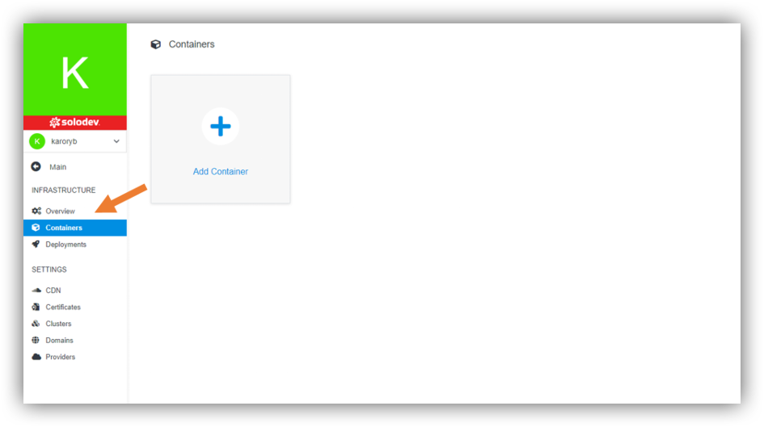
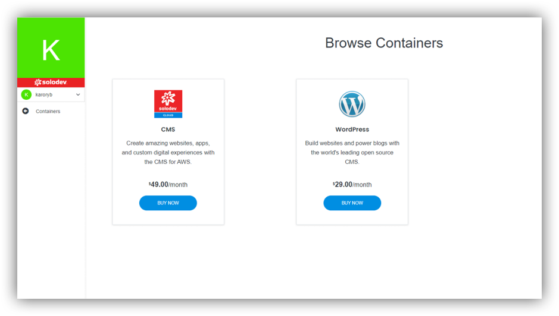

## About Containers

A container is a standard unit of software that packages up code and all its dependencies, so the application runs quickly and reliably from one computing environment to another. Then it can be run anywhere - on a PC, in a traditional IT environment or in the cloud.

Containers use a kind of operating system (OS) virtualization, in which the operating system functions are used to separate processes and control CPU resources, operating memory and mass memory for which these processes have access.

Containers are small, fast, and portable because, unlike a virtual machine, they don't need to include the guest operating system in each instance, and instead can use the host operating system's features and resources.

You can launch 2 containers on our Solodev Cloud. These are CMS or Wordpress.

### Solodev CMS

Solodev CMS is a content management platform that lets your team work together on digital transformation. Build amazing websites and apps, and get access to the latest digital marketing apps with 24/7 support – all powered by AWS. With Solodev, it’s easy to build amazing websites and manage content. Create a page in minutes or collaborate with your team to launch entire customer experiences that promote your brand.

### Wordpress

WordPress is the most popular CMS on the planet. Powerful yet simple, WordPress bring an ecosystem of tools and plugin features that make website content management easier than ever – so you can focus on publishing to your audiences.
With over 30% of all websites using WordPress, this open source system has a vast community of contributors and supporters. That translates into more options for plugins, widgets, and other innovative features. WordPress also features a deep marketplace of flexible themes and templates that make building easier than ever – with as little or as much access to code as you want. 
Ideal for media content applications, WordPress is perfect for blog-driven websites. In minutes, a low-code/no-code content marketer can publish an article and share it across channels. At the same time, savvy developers can get access to open source PHP and customize functionality.

---

## Adding Containers

You can find section containers on the left.

From the level of that page you are able to add container. Let’s click “Add Container”.

You can choose CMS or Wordpress.

### Installation of CMS:
- Click “Buy Now”.
- Choose add-ons if any and click “Complete Purchase”.
- Click “Install”.
- Add name of your website and choose domain. You can take the existing one or create new one by clicking “Add Domain”.
- Set your timezone based in your location.
- Select the CMS you want to add this website to. You can take the existing one or create new one by clicking “Add CMS”.
- Select Cluster. You can take the existing one or create new one by clicking “Add Cluster”.
- Select the theme you want to add this website.
- Click Add.

### Installation of Wordpress:
- Click “Buy Now”.
- Choose add-ons if any and click “Complete Purchase”.
- Click “Install”.
- Add name of your website and choose domain. You can take the existing one or create new one by clicking “Add Domain”.
- Set your timezone based in your location.
- Select the CMS you want to add this website to. You can take the existing one or create new one by clicking “Add CMS”.
- Select the theme you want to add this website.
- Click Add.

---

## Managing Containers

You can manage your containers by clicking on an individual button with its name. On the photo above there is an example of page with Solodev CMS. You can manage sites or users by adding/removing them.

