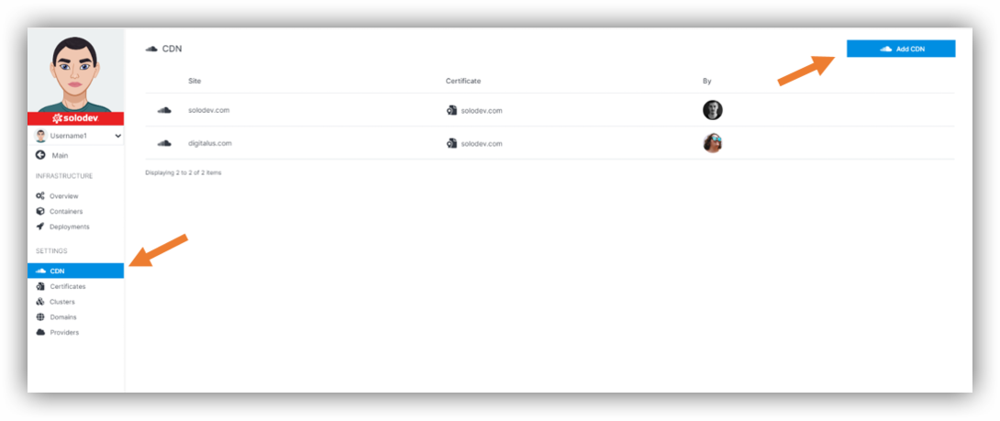
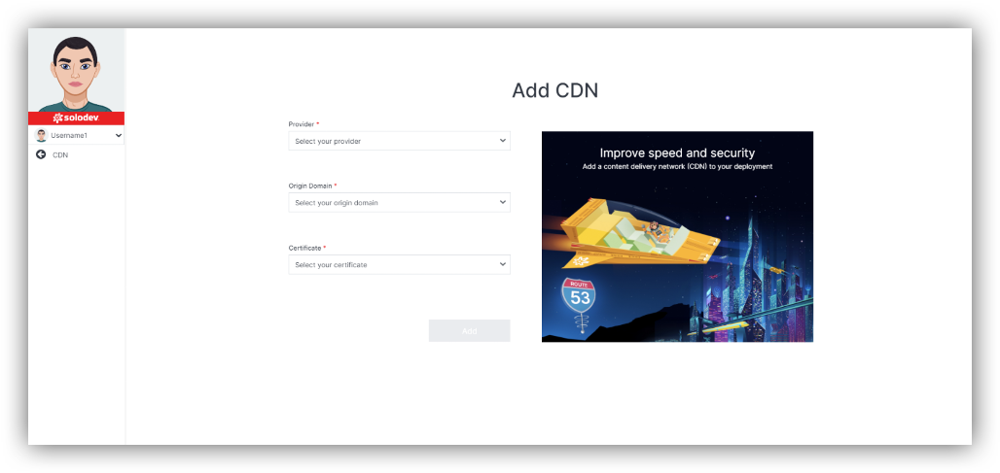

# Content Delivery Network (CDN)

## About CDN

A content delivery network (CDN) is a network of interconnected servers that accelerate webpage loading for data-heavy applications. Users get lower latency—the time it takes to load the first byte of the file—and higher data transfer rates.

## Adding CDN

In section Infrastructure, CDN is part of Settings in the left side of the page. Click on that.
There you have CDN list and option “Add CDN”.

----

If you would like to add CDN, you will be asked to:
- Select provider. You can take the existing one or create new one by clicking “Add Provider”.
- Enter origin domain.
- Select certificate. You can take the existing one or create new one by clicking “Add Certificate”.
- Click Add.

----

