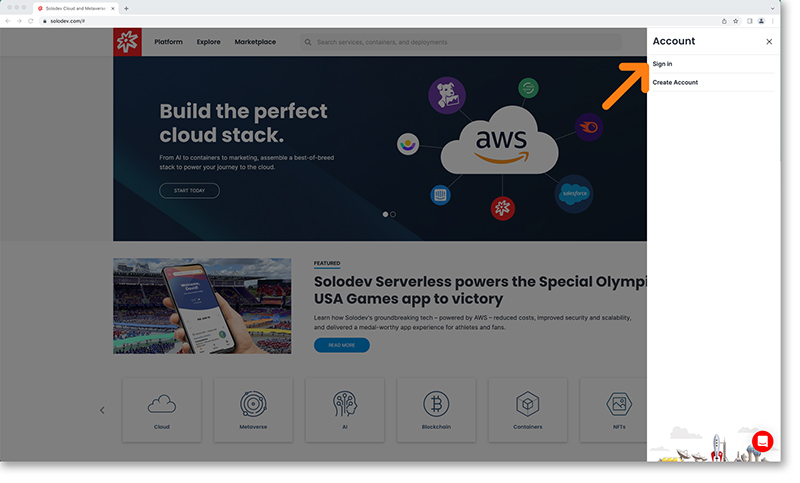

# Login

Users with existing accounts can sign into Solodev with your Solodev credentials your GitHub credentials. Visit [Solodev.com](https://Solodev.com/) and click the digital wallet icon in the top right of your screen. 

This will open the login modal to the right where you will select *“Sign In”*. 

This will bring you to our ID page where in order to sign in you’ll be able to choose between Solodev and GitHub credentials.

!!!
**Trouble Logging In?**

*If you’re having trouble logging in, please hit the “can’t login?” link on the Solodev ID page or the “Forgot Password” link on the GitHub credentials screen and follow the steps.*
!!!