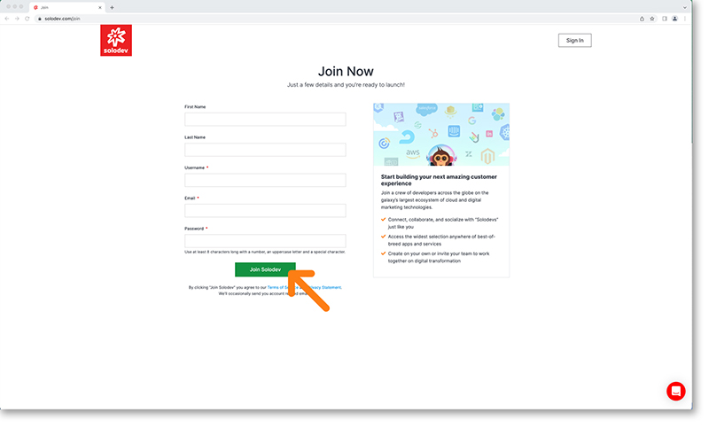

# Register account

First, you’ll need to set up a new account. Visit [Solodev.com](https://Solodev.com/) and click the digital wallet icon in the top right of your screen. 

This will open the login modal to the right where you will select *“Create Account”*. 

This will bring you to our join now page where you’ll need to enter a few quick details including:

- First Name
- Last Name
- Username
- Email
- Password (Passwords must be at least 8 characters long including one uppercase letter, one special character and alphanumeric characters.)

**Password Tips:**

- *Avoid using common words & patterns that are easy to guess.*
- *Don’t use personal info.*

!!!
***Please note:** Before hitting the green “Join Solodev” button. We ask you read and review our [terms of service](https://www.solodev.com/terms/) and [privacy statement](https://www.solodev.com/terms/privacy-policy.stml). **On acceptance, you will be automatically enrolled in the free developer plan.***
!!!

!!!
***Please note:** You will need to wait up to 48 hours for your account to be approved. If you need access sooner than this, please [contact us](https://www.solodev.com/contact/).*
!!!

