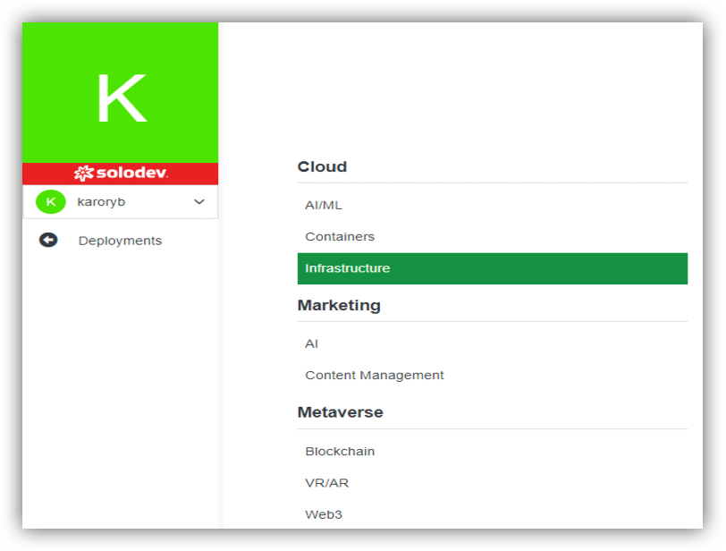
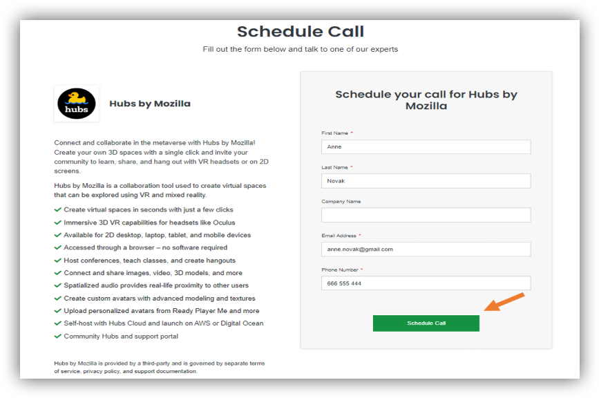
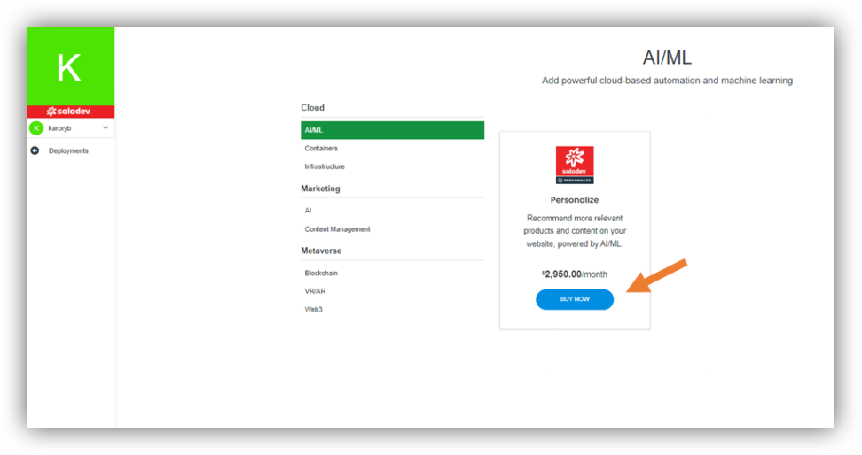
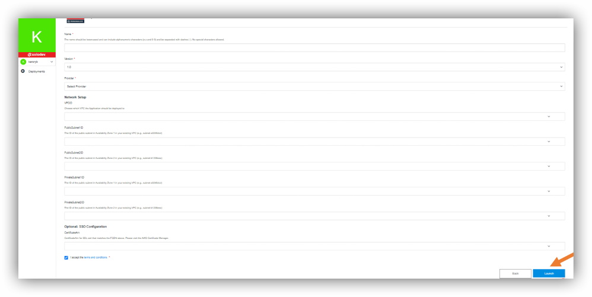
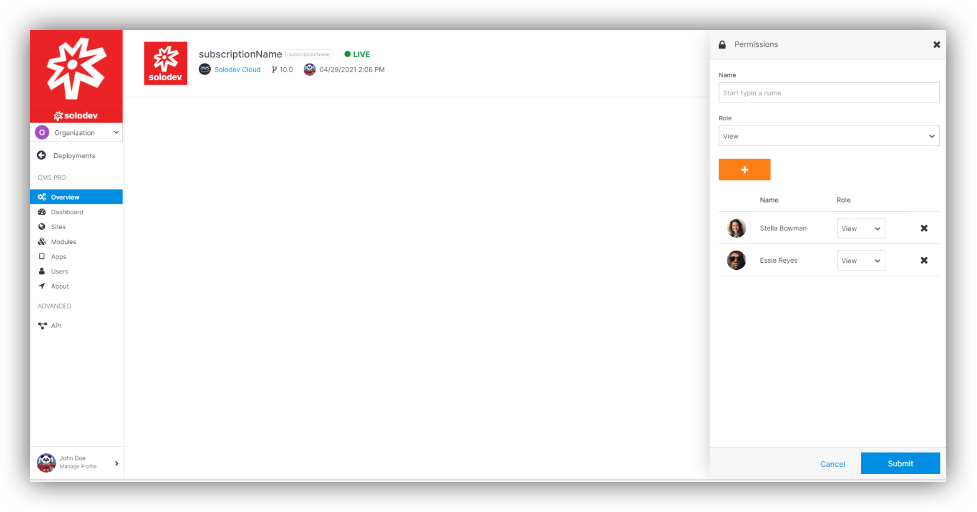

## About Deployments

In this section you will find all applications that you need to perform deployment. Deployment includes all of the steps, processes, and activities that are required to make a software system or update available to its intended users.

You can find section deployments on the left.

From the level of that page you are able to add container. Let’s click “Add Deployment”.
On the left you have the options to navigate. You can choose deployments from the 3 main groups: Cloud, Marketing and Metaverse. They are divided into the subgroups.

---

## Deployment Options

### Cloud 

#### AI/ML

##### Personalize

Powered by AWS, Solodev provides a cloud-based recommendation engine for websites and apps that can be deployed quickly, so you can start serving AI-driven product recommendations across your digital experiences, including eCommerce stores, blogs, streaming video, and more.

A fully-managed solution, Solodev taps the power of Amazon Personalize – the same engine used by Amazon.com – to surface relevant recommendations based on real-time user interactions. Leveraging powerful AI from AWS, Solodev Personalize goes beyond the rigid, static, rule-based recommendation systems and automatically trains, tunes, and deploys custom machine learning models to deliver recommendations to customers across industries, from retail to media and beyond.

Product option:

- Professional (2.950 $/month)

#### Containers

##### Chart Museum

To find out what is Chart Museum, you have to learn what is Helm. This is the first application package manager running atop Kubernetes. It allows users to describe the application structure through convenient Helm Charts, and manage it with simple commands. It’s a huge shift in the way the server-side applications are defined, stored, and managed.

Chart Museum is an open-source Helm Chart Repository written in Go (Golang) with support for cloud storage backends, including Google Cloud Storage, Amazon S3, Microsoft Azure Blob Storage, Alibaba Cloud OSS Storage, and Openstack Object Storage. It is used to store and serve Helm Charts to deploy apps to a Kubernetes cluster. ChartMuseum performs the task of being a Chart Management tool. When Charts are uploaded to a cloud store, ChartMuseum acts like a binary to fetch and maintain the Chart information.

#### Infrastructure

##### Solodev Backup

Solodev Backup offers a cost-effective, fully-managed, policy-based service that simplifies application redundancy. Each night, a complete backup of your website, container, or cloud app is added to a custom AWS Backup Vault, giving you confidence that your data is stored safely.

Product options:
- Monthly (5$/ month)
- Enterprise

##### Solodev CDN

Content Delivery Networks often improve performance by reducing latency while also offering scalability for peak traffic times. In short, they’ll speed up your site. CDNs work by distributing your website files across a network of servers around the world. Just like with online shipping, closer proximity to your desired product means it shows up on your doorstep faster.

Product options:

- Base (49$/ month)

### Marketing

#### AI

#####  Personalize [Read more](#personalize)

#### Content Management

##### CMS Enterprise

CMS Enterprise is the perfect launch pad for development projects of any size, giving you optimal control in a streamlined package. You are provided with best-of-breed CMS features, access to PHP, Apache, MySQL, and Mongo - all fueled by the rock-solid redundancy, security, and scalability of AWS.
By using CMS Enterprise you are able to create rich, enterprise-grade websites that engage and convert. You can share comments and review ideas, run content operations with little or no code, build complex, API-driven applications like eCommerce shopping carts, inventory systems, and more, customize advanced integrations with best-of-breed software and IoT devices.

Product options:
- Medium (1.750 $/month) - For AWS Medium EC2 Cluster Deployment.
- Large (2.950 $/month) - For AWS Large EC2 Cluster Deployment.
- XLarge (4.750 $/month) - For AWS Xlarge EC2 Cluster Deployment.

##### Solodev Static

Solodev Static helps you build static pages with an easy to use drag and drop builder. You can create the page very simply by placing individual elements onto a canvas.

Product option:

- Starter Package (5 $/ month)

##### CMS Pro

CMS Pro provides you with Professional Edition includes Solodev CMS license, PHP, Apache, and Mongo for a single web node and an external RDS MySQL database.

Product options:
- Small (345 $/ month) - For AWS Small EC2 Instance Deployment.
- Medium (495 $/month) - For AWS Medium EC2 Instance Deployment.
- Large (895 $/month) - For AWS Large EC2 Instance Deployment.
- XLarge (1.495 $/month) - For AWS XLarge EC2 Instance Deployment.

### Metaverse

#### Blockchain

##### Cardano

Cardano is a leading public blockchain that lets developers and organizations build custom blockchain apps and accept crypto payments in the Solodev Cloud.

Unlike other public blockchains, Cardano provides a solution that’s peer-reviewed and supported by evidence-based methodologies. This makes Cardano one of the most secure and sustainable blockchains on the market, delivering a trusted, transparent framework for building blockchain-powered apps and crypto strategies in the Solodev Cloud.  

##### Ethereum

Ethereum is minting the future of blockchain and cryptocurrency. Second in market value to Bitcoin, it is one of the world’s most popular open source blockchain platforms. It enables the smart contracts and applications built on its blockchain to run smoothly without fraud, downtime, control, or any third-party interference.

#### VR/AR

##### Hubs by Mozilla

Hubs by Mozilla is a collaboration tool used to create virtual spaces that can be explored using VR and mixed reality. It's a dynamic first-person experience that’s accessible by VR headsets like Oculus or via 2D screens with a keyboard and mouse – setting it apart from other browser-based collaboration tools.

Hubs is for anyone who wants to connect with others remotely and bring communities together in a shared virtual space. With Hubs, you can create your own 3D spaces and instantly invite others to join using just a URL – and there’s no installation or app required.

### Web3

##### Cardano [Read more](#cardano)

## Adding Deployments

### How to add:

#### Chart Museum
#### Cardano
#### Ethereum
#### Hubs by Mozilla

In order to add the above you need to fill out the formular to talk to one of our experts. There is an example below (Hubs by Mozilla):

  
- Go to the dedicated subgroup (in this case: VR/AR).
- Click More Info.

- Choose product option (if any, in this case this is not applicable).
- Click “Call Us” and 

- Fill up your data as prompted.
- Click “Schedule Call”

After that you should be redirected to the page with “Thank You message”. You will be able to return to the dashboard by clicking button marked on the photo. 

You should also receive an email confirmation, that message has been sent. 

#### Personalize

In order to add Personalize:

- Go to the AI/ML subgroup.

- Click “Buy Now”

- Choose add-ons (Additional Campaign, 1.850.00 $), if needed.
- Click “Complete Purchase”.

- Click “Install”.

- Add Name.
- Select the Provider. You can take the existing one or create new one by clicking “Add Provider”.
- Mark “I accept the terms and conditions”.
- Click “Launch”.

#### Solodev Backup

Please refer to the screens in [Personalize](#personalize) section, as the steps are nearly the same.

- Go to Infrastructure subgroup.
- Click “Buy Now”.
- Choose product option (please see Deployment options).
- Click “Buy Now”.
- Choose add-ons (Additional Storage (GB), 0.50 $), if needed.
- Click “Complete Purchase”.
- Click “Install”.

#### Solodev CDN?

Please refer to the screens in [Personalize](#personalize) section, as the steps are nearly the same.

- Go to Infrastructure subgroup.
- Click “Buy Now”.
- Click “Buy Now”.
- Choose add-ons (Additional Requests, 0.50 $/ month or Additional MByte(s), 0.50 $/ month), if needed.
- Click “Complete Purchase”.
- Click “Install”.

#### CMS Enterprise

Please refer to the screens in [Personalize](#personalize) section, as the steps are nearly the same.

- Go to Content Management subgroup.
- Click “Buy Now”.
- Choose product option (please see Deployment options).
- Click “Buy Now”.
- Click “Complete Purchase”.
- Click “Install”.
- Add Name.
- Select the Provider. You can take the existing one or create new one by clicking “Add Provider”.
- Mark “I accept the terms and conditions”.
- Click “Launch”.

#### Solodev Statics

Please refer to the screens in [Personalize](#personalize) section, as the steps are nearly the same.

- Go to Content Management subgroup.
- Click “Buy Now”.
- Click “Buy Now”.
- Choose add-ons (Additional Pages, 1.00 $/ month), if needed.
- Click “Complete Purchase”.
- Click “Install”.

You will be asked to add site. Please refer to the Sites -> Adding Sites -> Creation by using Static.

#### CMS Pro

Please refer to the screens in [Personalize](#personalize) section, as the steps are nearly the same.

- Go to Content Management subgroup.
- Click “Buy Now”.
- Choose product option (please see Deployment options).
- Click “Buy Now”.
- Click “Complete Purchase”.
- Click “Install”.
- Add Name.
- Select the Provider. You can take the existing one or create new one by clicking “Add Provider”.
- Mark “I accept the terms and conditions”.
- Click “Launch”.

## Managing Deployments

When you are in the Deployments, you can choose any of products that have been launched. After clicking, you will be able to manage your deployments.

How to do it? Let’s click on the button “Update”, that is placed on the top right of the page.

You will be able to change the name of your product or after expanding option “Advanced”, you can also delete your product.

When you click on the peak pointing downward (on the right of “Update”), you will be able to use 2 options: Upgrade and Permissions.

When you choose “Upgrade”, you will be able to upgrade your product version. You have type UPGRADE in the field and click “Upgrade”

2nd option will let you manage your permissions. You will be able to add or delete users, giving them or changing their roles.

