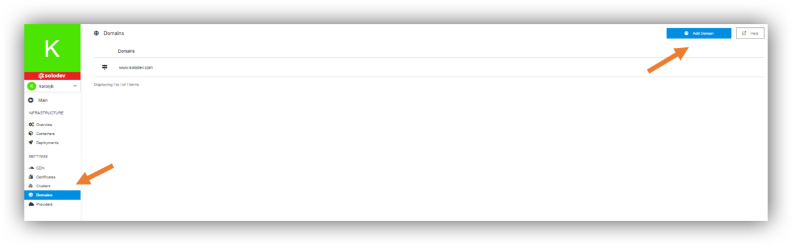
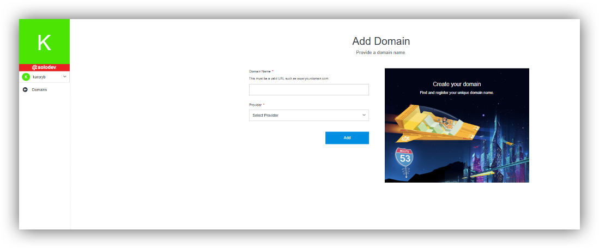

## About Domains

A domain name is a unique, easy-to-remember address used to access websites, such as 'google.com', and 'facebook.com'. Users can connect to websites using domain names thanks to the DNS system. You need to ad domain to create sites and pages.

---

## Adding Domains

In section Infrastructure, Domains are part of Settings in the left side of the page. Click on that. There you have an option “Add Domain” and list of domains.

- Add Domain Name. This must be a valid URL such as www.yourdomain.com.

- Select provider. You can take the existing one or create new one by clicking “Add Provider”.
- Click Add.

After adding your domain you can manage it. To do that, you can use the 2 options on the right (“Update” and peak pointing downward). -> Please see more in the section [Managing deployments](/infrastructure/deployments/#managing-deployments). 