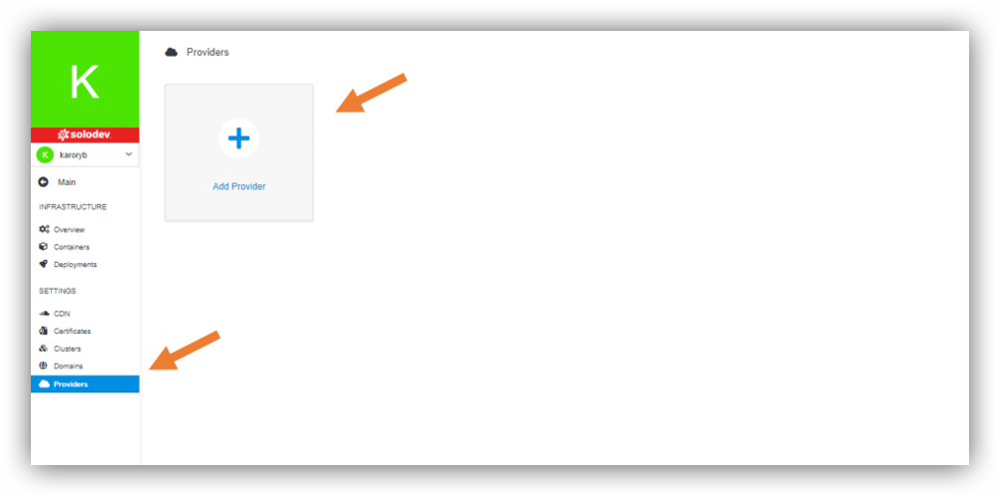

## About Providers
Amazon web service (AWS) is an online platform that provides scalable and cost-effective cloud computing solutions.

AWS is a broadly adopted cloud platform that offers several on-demand operations like compute power, database storage, content delivery, etc., to help corporates scale and grow.

One of the reasons why many businesses use AWS is because –as it was mentioned- it offers multiple types of storage to choose from and is easily accessible as well. It can be used for storage and file indexing as well as to run critical business applications. Businesses can also host their websites on the AWS cloud, similar to other web applications. 

A feature that separates AWS from other cloud services is its capability to launch and scale mobile, e-commerce, and SaaS applications. API-driven code on AWS can enable companies to build uncompromisingly scalable applications without requiring any OS and other systems.

Product options:

- Connect (0 $) - For AWS Medium EC2 Cluster Deployment.
- Enterprise (2.500 $/month) – You get world-class service to set up your AWS environment, access to AWS Certified Solution Architects, turnkey setup of an enterprise-grade environment, access to high availability services, you can also consult consult on custom add-ons it includes up to $2,000 in spend is.

---

##Adding Providers

In section Infrastructure, Providers are part of Settings in the left side of the page. Click on that. There you have an option “Add Provider”.

If you would like to add provider, you should:
- Choose “Add Provider”.
- Click “Get Now”.
- Choose product option (please see -> About Providers).
- Click “Install for free” or “Buy now”, depending on the product option you choose.
- Choose add-ons (Spend, 1.01 $/ month), if needed. Only in case of Enterprise option.
- Click “Complete Purchase”.
- Click “Install”.
- Log in to your AWS account.
- Create the required IAM Role & Policy with our step-by-step instructions.
- Add Name.
- Select Region.
- Add Access Key.
- Add Secret Key.
- Click “Connect”.

