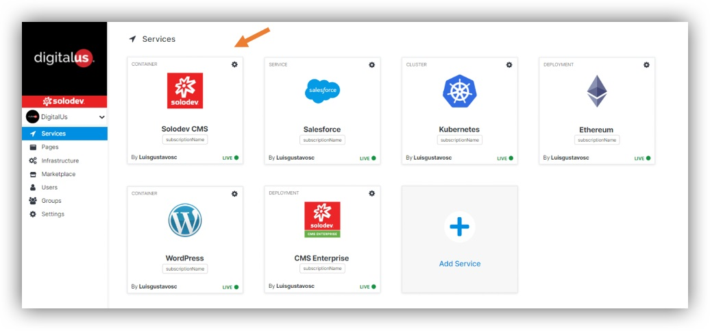

## About Modules

Modules are dynamic functionalities like blogs and calendars that can be added to your CMS.
What does the section “Modules” contain?

### Blog 

The Solodev Blog Module lets you schedule when content goes live, keeping your team and blog readers on schedule. The Blog Manager also gives your team a place to collaborate on long-form content. Include more than just copy by easily adding images and video to your posts.

Product option:
- Standard (Solodev Blog Module 0$/ month)

### Events

It allows you to leverage automated scheduling capabilities, an intuitive description editor, and simple categorization to showcase the next big event for your company. You can even add Google Maps and Google Calendars integrations, letting your customers save the event information directly to their personal calendars.

Product option:
- Standard (Solodev Events Module 0$/ month)

### Team

Team let you feature key members of your crew in a dedicated section and manage it all with ease in the Solodev Team Center. Yu can build a custom frontend design to showcase your staff and make it simple for your content team to edit on the fly. 

The Team Center can be installed easily on your Solodev deployment. Each module includes 
customizable HTML backend for adding unique form fields and Solodev CMS documentation.

Product option:
- Standard (Solodev Team Module 0$/ month)

### Careers

With the Solodev Career Portal, you can create open listings with detailed descriptions so that users know what's currently available within your organization.

You are able to quickly add or adjust your content to meet the changing needs of your business. For example it is possible to include images, video and other media to showcase more of what your company can offer applicants. 

Product option:
- Standard (Solodev Careers Form 0$/ month)

### Contact Form

With the Contact Form Manager, you can embed this web form into any template and start receiving submissions at light speed. 

You are able to give visitors the opportunity to find the answers to questions they might have by showcasing links to helpful pages throughout your website. By linking to FAQ pages, helpful content, or relevant events, you can free your sales or customer service team up from answering repetitive questions.

Product option:
- Standard (Solodev Contact Form 0$/ month)

### Videos

Video module allows you to quickly and easily add videos directly into your website allowing you to create media rich content in minutes. You can embed videos from YouTube and Vimeo (as well as other providers) or upload videos and play them using HTML5 video player.

--- 

## Adding Modules

To add module you have to go to the Services and then click on Solodev CMS.

Then choose “Modules” on the left.

When you click “Add Module”, you will be redirected to the page where you will need to:

- Select Module.
- Enter its name.
- Select CMS.

After clicking “Launch” your module will be added to your container.

