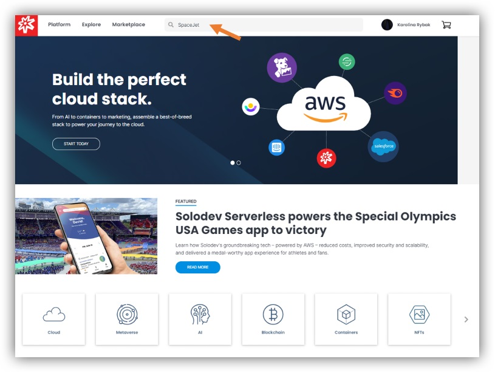
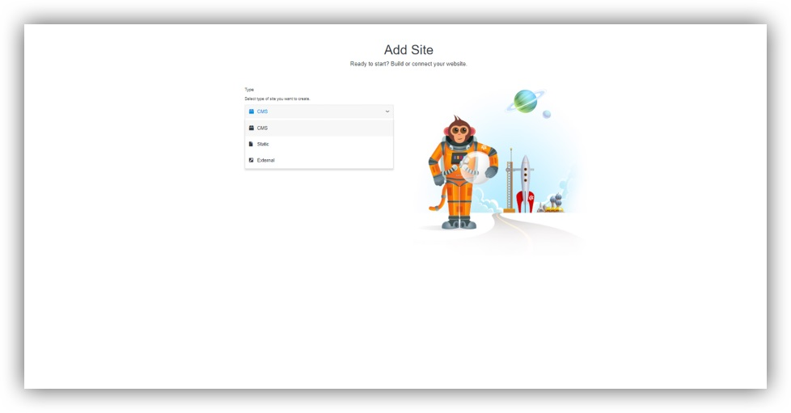
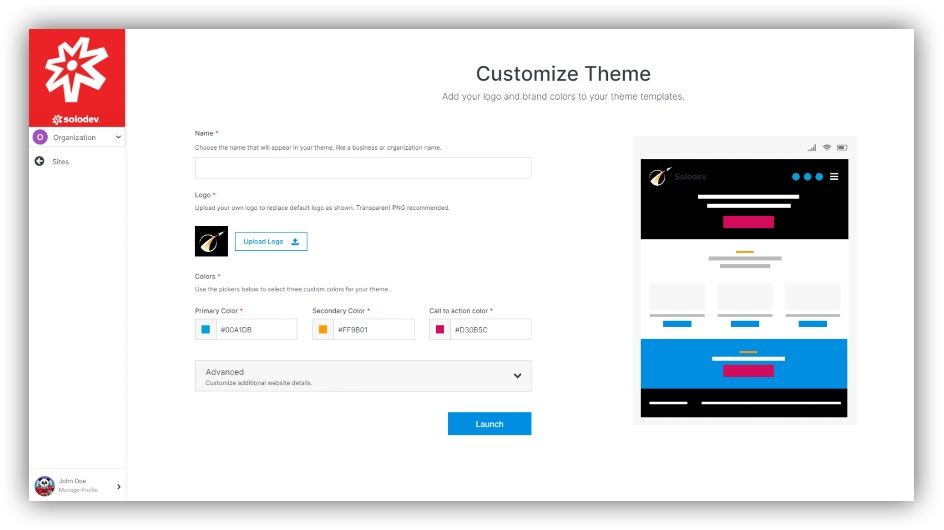

## About Themes

In relation to themes, Solodev offers SpaceJet: a simple, agency-quality website theme. You are able to start with a basic, low-code template, and in minutes, you can update elements like your logo, colors, and custom imagery and launch to the world. With just a few simple steps, you can have a fully-functional website ready to go live in no time.

---

## Adding Themes

To add SpaceJet:
 
- Search the name in the browser in Solodev main page.
- Click “Install for free”.
- Click “Complete Purchase”.
- Click “Install”.

Now you are redirected to the page “Add Site”. For more details please refer to the “Pages and Sites” section in this manual.

When you add theme, you can then customize it by adding name, logo and changing colors.

