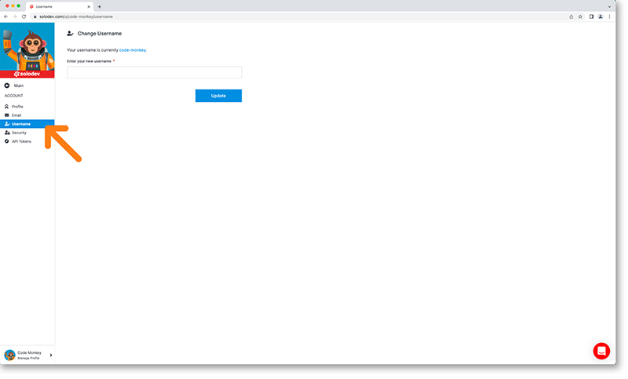
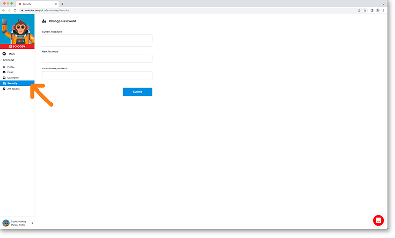

# Developer Account

Set up your developer establish basics like your custom user image/avatar, email, username and password. Your account settings can be found in the left nav under your profile.

---

## Change your email

- In the account dashboard click Email
- You will be presented a form to enter your new email address in the textbox
- Populate the textbox and click Update
- An alert appears in the bottom lefthand corner of the dashboard to notify you the email change is successful. (*NOTE: This function is currently unavailable*)

---

## Change your username

- In the account dashboard click Username
- You will be presented a form to enter your new username in the textbox
- Populate the textbox and click Update
- An alert appears in the bottom lefthand corner of the dashboard to notify you the username change is successful

---

## Change your password

- In the Account dashboard click Security
- You will be presented a form with the following fields: Current Password, New Password, Confirm New Password
- Populate the fields and click Update
- An alert appears in the bottom lefthand corner of the dashboard to notify you the password change is successful

!!!
*Passwords must be at least 8 characters long including one uppercase letter, one special character and alphanumeric characters.*
!!!

---

## API Tokens

- In the Account dashboard click API tokens
- You will be shown a table with your API keys
- You can add an API key at the top right of the dashboard

