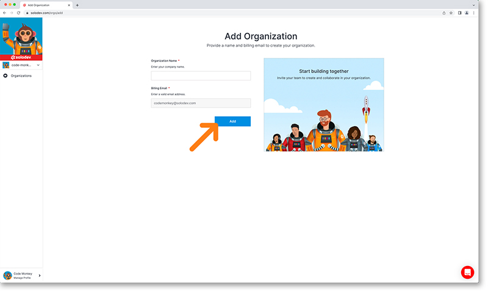
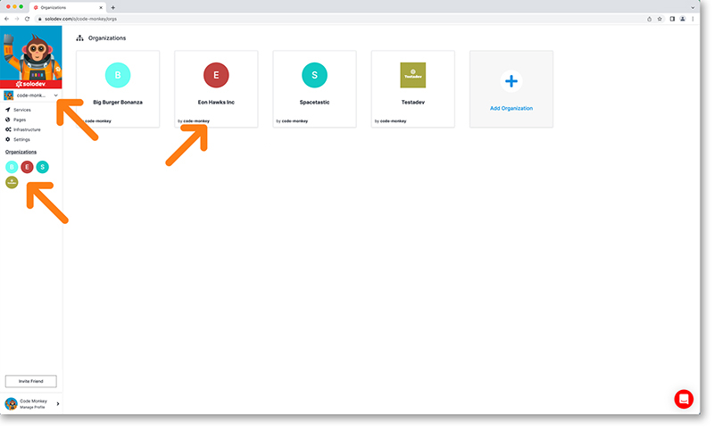

# Add Organization

It is very simple to add an organization to your account. From your dashboard select the organizations link from the main left nav. This will bring you to your organizations dashboard. 

Click the add organization card.

Enter your organization name and hit the add button. Your organization will be created and you’ll be taken back to the organizations dashboard. 

You can open your organization in three ways: click on the organization’s card, click on the organizations image in the left nav or toggle the drop-down menu under your avatar. This drop down is especially useful when jumping between several organizations.

