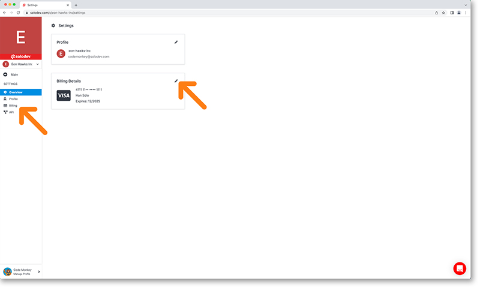
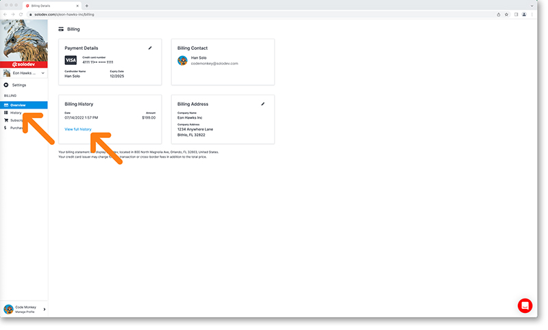

# Organization Settings

Update your organization’s settings by clicking on the settings option from the left nav. In settings you will be able to update your organization’s profile and billing information.

---

## Organization Profile

Click on the profile menu option in the left nav or the edit icon in the profile card. This will bring you to your profile page. 

1. You can update your email, country, postal code and enter a description for your organization here.
2. Press the update button to process any of the changes you make.
3. You can rename, delete and enable private catalogs for your organization here.
4. Organizations function similarly to your developer account. Solodev will autofill your image with a letter and color background upon creation. Customizing your image will help you and brand the organization to other users and the Marketplace community.

!!!
***Please note:** URLs used to login to an instance of Solodev installed within an organization change whenever the administrator changes the name of the organization.* 

*Deployments, websites, clusters and applications installed within an organization are deleted whenever the administrator deletes an organization.*
!!!

---

## Organization Billing

Click on the billing menu option in the left nav or the edit icon in the billing details card. This will bring you to your billing page. 

---

## Billing Home

Your billing page allows access to:

- Your payment details
- Your billing contact
- Your billing history
- Your billing address
- Your subscriptions (via left nav)
- Your purchases (via left nav)

---

## Payment details

You can update your payment credit card by clicking on the pencil icon in the top corner of the payment details card to open the details modal on the right. Once you make your necessary changes hit the blue submit button on the bottom right.	

---

## Billing history

You can view your billing history by selecting the history option in the left nav or by clicking on the “view full history” link in the card

Your complete billing history will be listed here with the ability to download an invoice in the last column on the right

---

## Billing address

You can update your billing address by clicking on the pencil icon in the top corner of the billing address card to open the details modal on the right. Once you make your necessary changes hit the blue submit button on the bottom right.
	

---

## Subscriptions

You can review your subscriptions by clicking on the main nav option. This will show you all of your subscriptions in card format in the workspace. You can filter by status with the drop down option at your top right. Clicking on the card itself will open the subscription detail (detail screen is covered in the Services section).

	
---

## Purchases

You can review your purchases by clicking on the main nav option. This will display all of your purchases in card format in the workspace. You can filter by status with the drop down option at your top right. Clicking on the card itself will take you to the appropriate screen depending on item type and item status.
	

