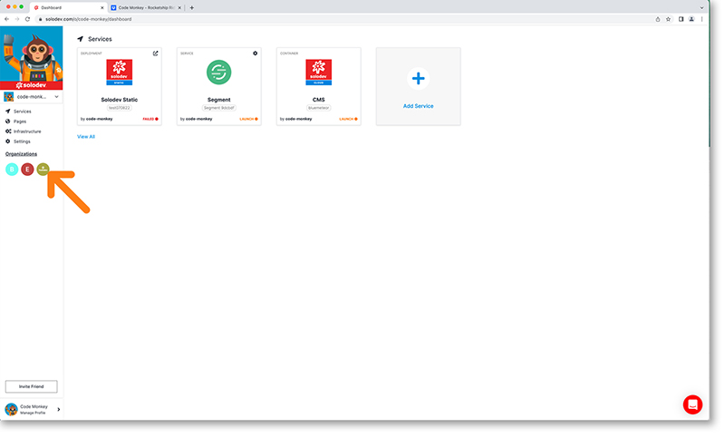

# Organizations

Organizations are the main subcategory of your developer account and are shared workspaces that facilitate collaboration across projects or teams depending on how you intend to use Solodev Cloud. With Solodev organizations, you can associate deployments, clusters, catalogs and websites with your organization and enjoy administrative privileges for these items. Solodev organizations allows you to manage member access to the organization's data and projects with sophisticated security features such as granular permissions. When combined with User Groups you are able to create simple or complex organization hierarchies or even replicate existing ones. You may create as many organizations as you need.

## Add An Organization

It is very simple to add an organization to your account. From your dashboard select the organizations link from the main left nav. This will bring you to the organization home page. 

Click the add organization card.

Enter your organization’s details when prompted. 

Update your org with your logo or image by clicking on the update org profile tile or the settings then profile options in the lefthand nav. Organizations function very similarly to your developer account. By default, Solodev will autofill your avatar image with a letter and color background upon creation. It will display in the top left corner of your dashboard. Adding a custom image will help you identify or brand your organization. It will also help brand the organization to other users and the Marketplace community.

