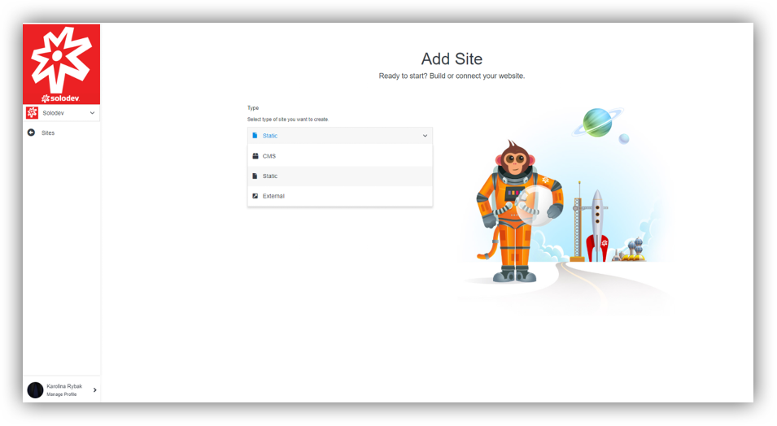

# Sites

## Adding Sites
Procedure of adding site is similar to add page. When you are in the section Pages, click on the button on the photo or in the bottom of the page. Both of them are titled “Add Site”.

----

You will be asked to choose one of the option to choose. You can find them on the screen. Read the description below.

----

### Creation of the site using CMS:
When you choose it, you will need to:
- Add name of your website and choose domain. You can take the existing one or create new one by clicking “Add Domain”.
- Set your timezone based in your location.
- Select the CMS you want to add this website to. You can take the existing one or create new one by clicking “Add CMS”.
- Select the theme you want to add this website.