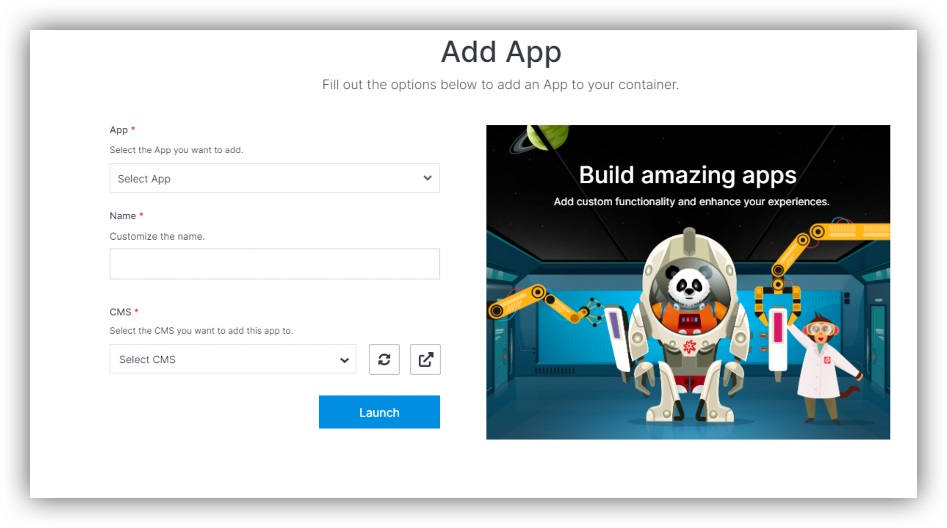

## About Applications

Solodev Cloud provides you with possibility to launch applications. It can be done by Solodev CMS. 

---
## Adding Applications

To add an application: 
- Go to the section “Apps” in Solodev CMS.
- Click “Add App”.
- Select App that you want to add (you can choose existing one or create new module).
- Enter name.
- Select CMS
- Click “Launch

