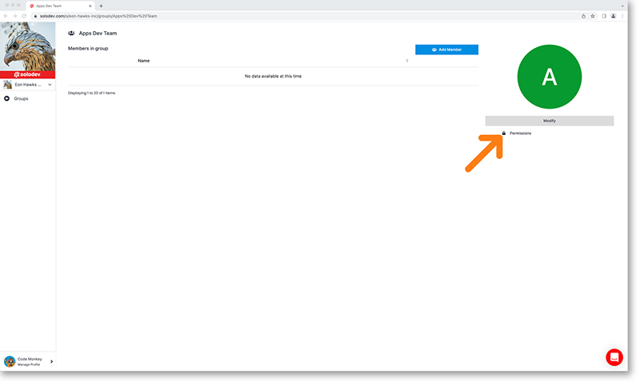
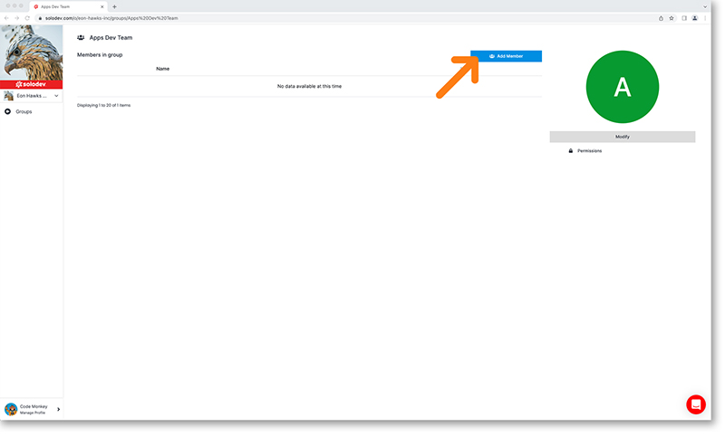
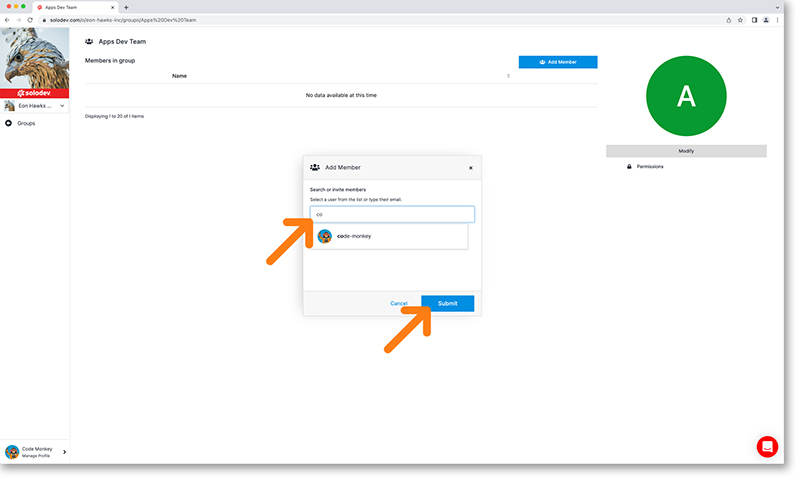

## Add Groups

Developers can use groups to mimic their organizational structure and take advantage of granular permissions. Create your groups by following the steps below.

In the Organization's dashboard, click groups in the left-hand nav. Click the add group button in the top right.

This will bring up the add group page where you can name your group and add a short description of the group. Click the blue add button to create the group and add it to your organization. You will be taken to the newly created group’s home page.

---

## Configure group permissions

You can take advantage of the robust permissions management system built in to Solodev cloud to specify actions and resources available to certain groups. Specifying group actions determines what each member of the group will see on their Solodev Cloud dashboard. For example, developers can create an accounting group where each user has access to settings and billing, while prohibiting access to Websites, Infrastructure, Users or Groups. 

To specify permissions for your group, click on the permissions link on the right-hand side of the page. This will open a modal with details.

Here you have complete customization ability of permissions. Expand each folder to add permissions to only parts of section. Every selection item has three permissions to choose from:

- View, which will allow users in the group to only see content
- Edit, which will allow users in the group to modify content
- Admin, which will allow users in the group full access to

Once you have configured all of your settings, click the blue submit button at the bottom right of the modal to apply them to your group.

!!!
***Please note:***

- *Selecting the main checkbox at the top will select all check boxes below*
- *Selecting the checkbox at the folder level will select all check boxes in that folder*
- *By leaving the default “Choose Role” and not selecting an option, users in the group will not be able to view that section*
!!!

---

## Add Users to your Group

To add members to your newly created group click on the blue add member button in the top right of your screen.

This will bring up a dialogue box. Start typing the name or email of the user you’d like to add and hit the blue submit button to add them to the group.

---

## Remove Users from your Groups

To remove a user from a group, go to that group’s home page. From there, find the user you’d like to delete and hit the X to the right of their row. This will bring up the warning module confirming you’d like to remove. To remove the user hit the blue submit button in the bottom right of the modal.

