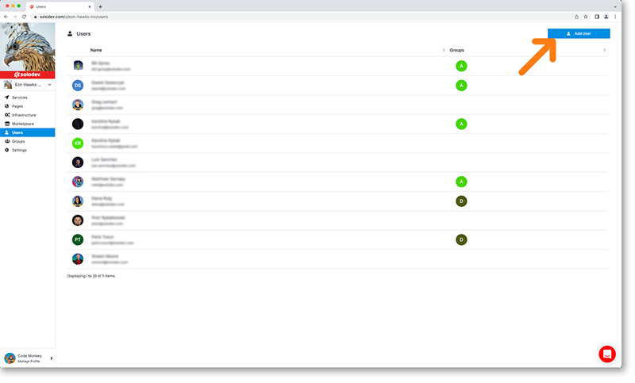
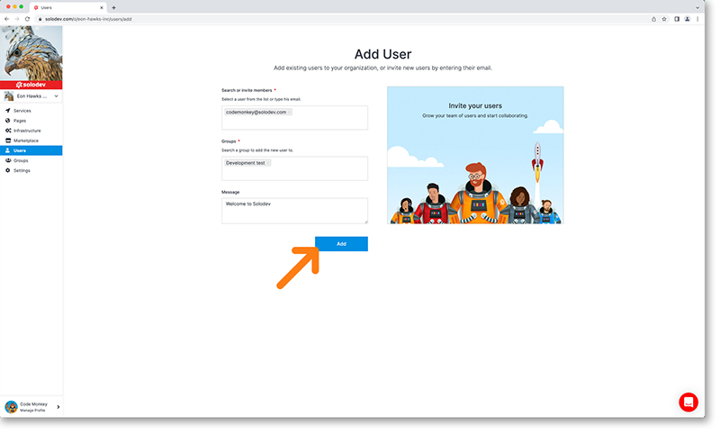

## Users Dashboard

You can click on the users option in the left nav to bring up the users dashboard. Here you’ll be able to:

- view all your users
- see what groups these users are a part of
- add new users

---

## Add users

To add a user, click on the blue add user button in the top right corner of the user dashboard. This will bring up the add user dialogue page.

In the add user page, you can:

- Invite a user with an existing Solodev account or a new user to the system
- Add them to an existing group
- Customize y­our welcome message to that user

Click the blue add button to complete the new user addition.

---

## Delete users

Developers can remove users from their organizations with the steps below. Please that users will have no access to groups or organizations once removed and must be re-invited to regain access. 

Deleting users from an organization
- In the Organization's dashboard, click Users.
- Click the trashcan icon next to the user to be removed.
- Review the warning and click Submit.

