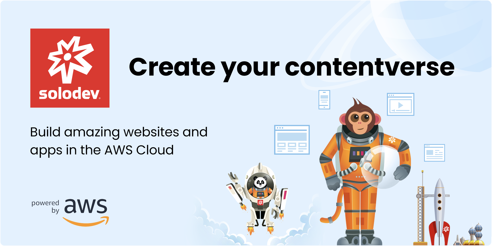

# Welcome to Solodev Cloud

----

---

## What is Solodev Cloud?

Solodev Cloud is a best-of-breed cloud-based solution to almost anything you can imagine. Whether you’re a single developer (Solodev) creating a custom app or a CTO looking to build a robust enterprise stack, Solodev Cloud has you covered. Our ever-growing Marketplace already has more than 100 options, from AI/ML, Web3, marketing, e-commerce, content management, SEO and so much more. Powered by AWS, Solodev Cloud is a turn key solution where you can unify your digital ecosystem with single-sign-on (SSO) and centralized billing with little to no coding.

---

## Our Solodev Cloud Plans
Solodev Cloud has a solution for your needs. There are three tiers to the Solodev Cloud platform: 

**Developer**

The developer plan is our free launchpad for building apps and containers in your own private catalog. You can develop custom apps with advanced cloud and container options and streamlined collaboration with multiple users, groups and organizations. This is the default plan you will enroll in upon account creation. 

**Seller**

This plan includes everything in the developer plan plus the ability to sell your custom apps in your own dedicated profile page. You can also sell other developers’ apps and add your apps to the Solodev Marketplace.

**Reseller**

This plan includes all of the above plus the ability to create your own custom catalog of pre-built apps and containers to resell. You can also stack your catalog with third-party apps from the marketplace and offer additional support or agency consulting services.

!!!
***Please note:** Paid plans are only available at the organization level. You must create an organization in order to upgrade to a paid plan.*
!!!

