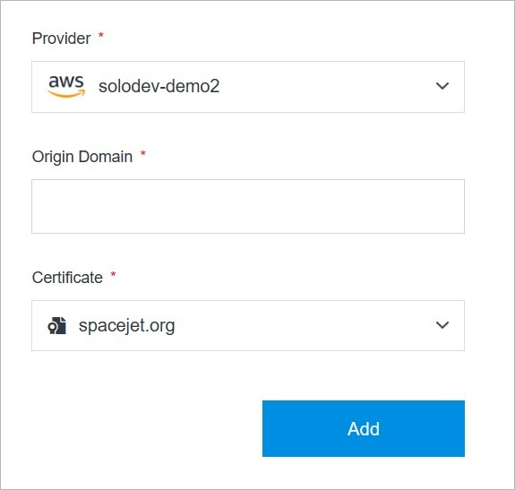

# Add CDN

Adding a CDN in Solodev Cloud is a simple process, and can be completed in minutes.

</a>

**Name** | **Description** 
:--- | ---
Provider | Choose a provider from the drop-down list or select the add provider option.
Origin Domain | Enter your origin domain.
Certificate | Choose a certificate from the drop-down list or select the add certificate option.

## Confirm

Once you have completed all the fields, click **Add** to create your CDN.

!!!Note:
The CDN build process may take several minutes to complete after clicking the **Add** button. Do not close or quit your browser during this process.
!!!

