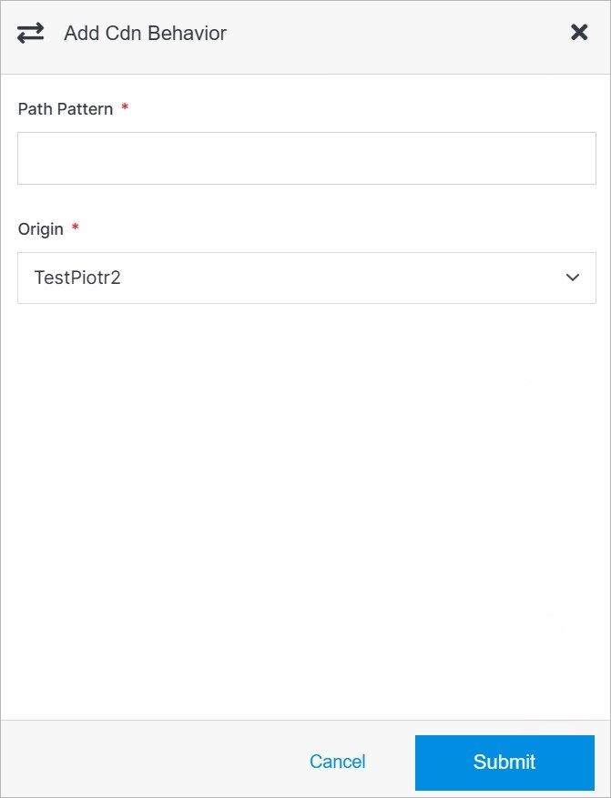

# Add CDN Behavior

Adding a CDN Behavior in Solodev Cloud is a simple process, and can be completed in minutes.

></a>

**Name** | **Description** 
:--- | ---
Description | Add the CDN description.
Add Object Path | Add the path for each object that you want to remove from the CloudFront cache. You can use wildcards (*). After entering the path use button **Add**.

## Confirm

Once you have completed all the fields, click **Add** to create your CDN.

!!!Note:
The CDN build process may take several minutes to complete after clicking the **Add** button. Do not close or quit your browser during this process.
!!!
