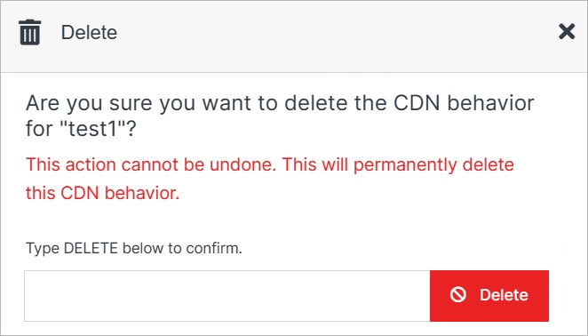

# Delete

Under the Advanced dropdown, you can execute advanced operations such as deleting a CDN. 

</a>

**Name** | **Description** 
:--- | ---
Delete | To remove your CDN, type **DELETE** in all caps into the field and click the red Delete button.

!!! Note:
Deleting a CDN will permanently remove the CDN and all of its content and cannot be undone.
!!!

