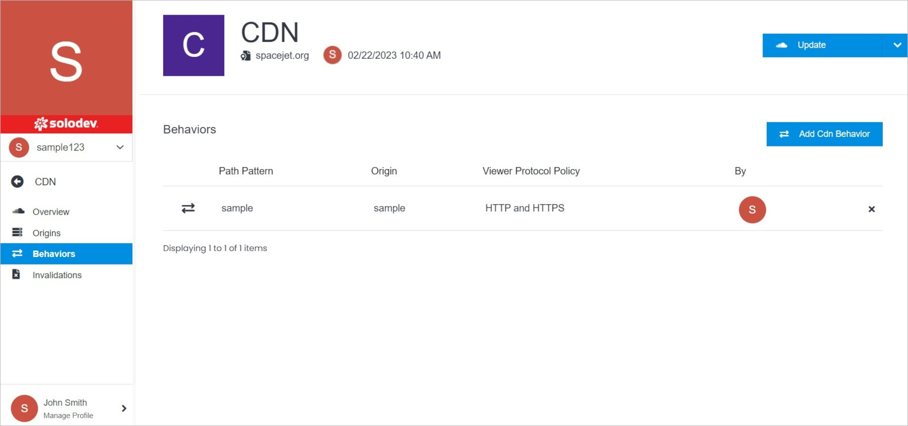

# Behaviors

CDNs Behavior are presented in the form of a table with the details such as path pattern, origin, viever protocol policy, and CDN creator. You can open the CDN Behavior Overview page by clicking it. 

</a>

**Name** | **Description** 
:--- | ---
<a href="/infrastructure/cdn/cdn-overview/update/">Update</a> | Edit CDN Behavior settings, delete the CDN Behavior.
<a href="/infrastructure/cdn/cdn-overview/geo-restrictions/">GEO Restrictions</a> | Manage your GEO restrictions.
<a href="/infrastructure/cdn/cdn-overview/permissions/">Permissions</a> | Manage your permissions.
<a href="/infrastructure/cdn/cdn-overview/behaviors/cdn-behavior-overview">CDN Behavior Overview</a> | Manage your CDN Behavior by opening any CDN Behavior listed.
<a href="/infrastructure/cdn/cdn-overview/behaviors/add-cdn-behavior">Add CDN Behavior</a> | Add your CDN Behavior.
