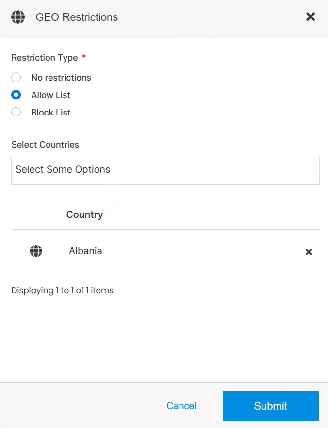

# GEO Restrictions

The CDN GEO Restriction modal allows you to add and remove restrictions to your CDN.

</a>

**Name** | **Description** 
:--- | ---
Restriction Type | Choose from three types of restrictions. See note below.
Select Countries | Select the country the restrictions apply to.
Delete | Click the **"x"** button to remove country from the list.

!!!Note:
Choose from three types of restrictions:

- **No restrictions:** Default.
- **Allow list:** Any country on the list will be allowed, the rest will be blocked.
- **Block list:** Any country on the list will be blocked, the rest will be allowed.
!!!

## Confirm

Once you have completed all the fields, click **Submit** to apply your changes.

