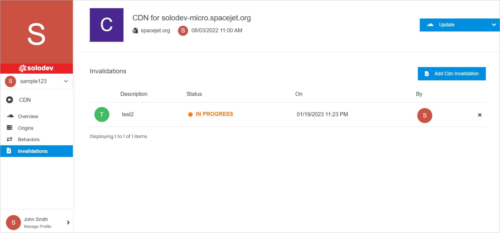

# Invalidations

After an object is cached, it normally remains in the cache until it expires or is evicted to make room for new content. You control the expiration time through standard HTTP headers. You might want to remove an object from the cache prior to its normal expiration time.

CDNs Invalidation are presented in the form of a table with the details such as description, status, date of creation, and CDN creator. You can open the CDN Invalidation page by clicking it. 

</a>

!!!Note:
You can open CDN Invalidation only when its status is **Live**.
!!!

**Name** | **Description** 
:--- | ---
<a href="/infrastructure/cdn/cdn-overview/update/">Update</a> | Edit CDN Invalidation settings, delete the CDN Invalidation.
<a href="/infrastructure/cdn/cdn-overview/geo-restrictions/">GEO Restrictions</a> | Manage your GEO restrictions.
<a href="/infrastructure/cdn/cdn-overview/permissions/">Permissions</a> | Manage your permissions.
<a href="/infrastructure/cdn/cdn-overview/invalidations/cdn-invalidation-overview">CDN Invalidation Overview</a> <!-- need to fix this link  --> | Manage your CDN Invalidation by opening any CDN Invalidation listed.  
<a href="/infrastructure/cdn/cdn-overview/invalidations/add-cdn-invalidation">Add CDN Invalidation</a> | Add your CDN Invalidation.
