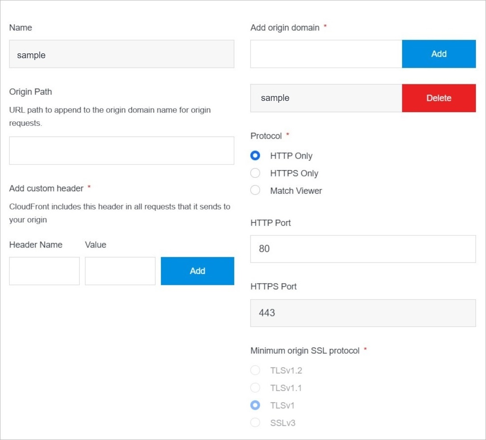
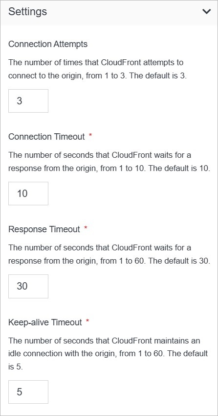

# CDN Origin Overview

The CDN Origin Overview page shows you important CDN Origin details as well as the ability to update your CDN Origin.

</a>

**Name** | **Description** 
:--- | ---
<a href="/infrastructure/cdn/cdn-overview/permissions">Permissions</a> | Manage your permissions.
<a href="/infrastructure/cdn/cdn-overview/origins/cdn-origin-overview/delete">Delete</a> | Delete your CDN Origin.
<a href="/infrastructure/cdn/cdn-overview/origins/cdn-origin-overview/#manage-cdn-origin">Manage CDN Origin</a>| Manage your CDN Origin.
[Settings](https://cloud.solodev.net/infrastructure/cdn/cdn-overview/origins/cdn-origin-overview/#settings) | Manage your CDN Origin Settings.

## Manage CDN Origin

Manage CDN Origin

</a>

**Name** | **Description** 
:--- | ---
Origin Path | Enter the origin path.
Add Custom Header - Header Name | Enter the header name.
Add Custom Header - Value | Enter the value.
Add Origin Domain | Add the origin domain by using button **Add**.
Delete Origin Domain | Delete the origin domain by using button **Delete**.
Protocol | Choose the protocol. You can choose between **HTTP Only**, **HTTPS Only**, **Match Viewer**.
HTTP Port |Enter the HTTP port.
Minimum origin SSL protocol | Enter the minimum origin SSL protocol. You can choose between **TLSv1.**, **TLSv1.1**, **TLSv1**, **SSLv3**.

## Settings

Manage CDN Origin settings.

</a>

**Name** | **Description** 
:--- | ---
Connection Attempts | Enter the number of times that CloudFront attempts to connect to the origin, from 1 to 3. The default is 3.
Connection Timeout | Enter the number of seconds that CloudFront waits for a response from the origin, from 1 to 10. The default is 10.
Response Timeout | Enter the number of seconds that CloudFront waits for a response from the origin, from 1 to 60. The default is 30.
Keep-alive Timeout | Enter the number of seconds that CloudFront maintains an idle connection with the origin, from 1 to 60. The default is 5.

## Confirm

Once you have completed all the fields, click **Save** to apply your changes.

