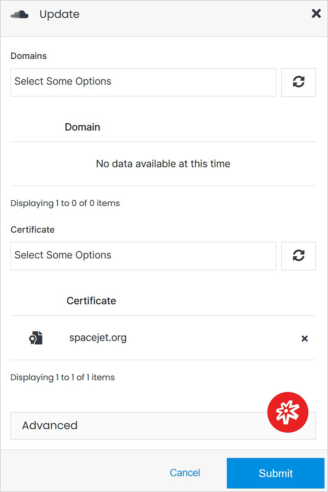
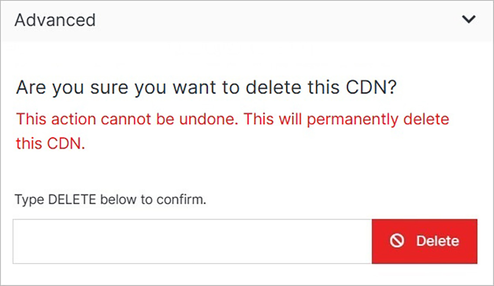

# Update

Manage domains and certificates. Delete the CDN.

</a>

**Name** | **Description** 
:--- | ---
Domains | Add or change the CDN's domain.
Delete Domain | Click the **"x"** button to remove the domain.
Certificate | Add or change the CDN's certificate.
Delete Certificate | Click the **"x"** button to remove the certificate.
<a href="/infrastructure/cdn/cdn-overview/update/#advanced">Advanced</a> | Manage the advanced settings.

## Advanced

Under the Advanced dropdown, you can execute advanced operations such as deleting a CDN. 

</a>

**Name** | **Description** 
:--- | ---
Delete | To remove your CDN, type **DELETE** in all caps into the field and click the red Delete button.

!!! Note: 
Deleting a CDN will permanently remove the CDN and all of its content and cannot be undone.
!!!

