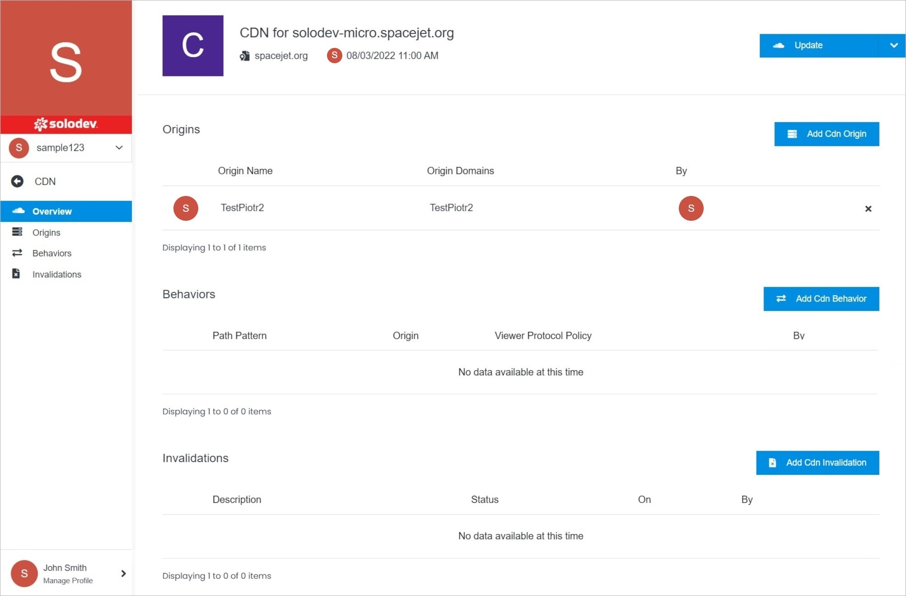

# CDN Overview

The CDN Overview page displays important CDN details and the ability to update your CDN.

</a>

**Name** | **Description** 
:--- | ---
<a href="update/">Update</a> | Edit CDN settings, delete the CDN.
<a href="geo-restrictions/">GEO Restrictions</a> | Manage your GEO restrictions.
<a href="permissions/">Permissions</a> | Manage your permissions.
<a href="/infrastructure/cdn/cdn-overview/origins/">Origins</a> | Manage your CDN Origin.
<a href="/infrastructure/cdn/cdn-overview/origins/add-cdn-origin">Add CDN Origin</a> | Add your CDN Origin.
<a href="/infrastructure/cdn/cdn-overview/behaviors/">Behaviors</a> | Manage your CDN Behavior.
<a href="/infrastructure/cdn/cdn-overview/behaviors/add-cdn-behavior">Add CDN Behavior</a> | Add your CDN Behavior.
<a href="/infrastructure/cdn/cdn-overview/invalidations/">Invalidations</a> | Manage your CDN Invalidation.
<a href="/infrastructure/cdn/cdn-overview/invalidations/add-cdn-invalidation">Add CDN Invalidation</a> | Add your CDN Invalidation.