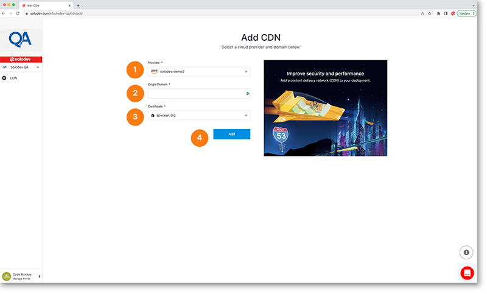

# Add CDN

The add CDN page allows you to add a CDN to your project.

1. Choose a provider from the drop-down list or select the add provider option
2. Enter your origin domain
3. Choose a certificate from the drop-down list or select the add certificate option
4. Click the blue add button to add your new CDN
	

