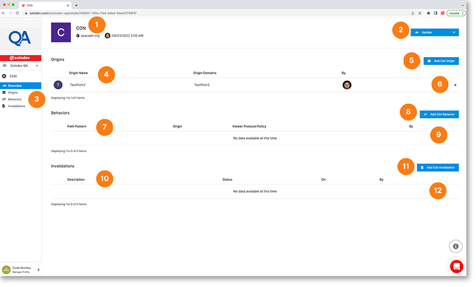

# CDN Details

On the CDN detail page, you can easily manage your CDNs.

1. View your CDN’s certificate and modification information
2. Click on the blue button to update your CDN or click on the drop-down option to access GEO Restrictions and Permissions
3. The main left nav allows you direct access to listings of all of your Origins, Behaviors, and Invalidations
4. Listing of Origins for this CDN
5. Add a new CDN Origin
6. Delete this CDN Origin
7. Listing of Behaviors for this CDN
8. Add a new CDN Behavior
9. Delete this CDN Behavior
10. Listing of Invalidations for this CDN
11. Add a new CDN Invalidation
12. Delete this CDN Invalidation

