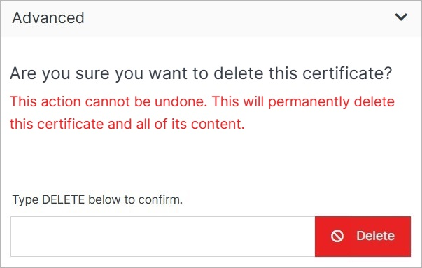

# Update

Delete a certificate from your Solodev Cloud by clicking the **Update** button on the Certificate Overview page.
 
</a>

**Name** | **Description** 
:--- | ---
Delete | To remove your certificate, type **DELETE** in all caps into the field and click the red Delete button.

!!! Note:
Deleting a certificate will permanently remove the certificate and all of its content and cannot be undone.
!!!

SPARK