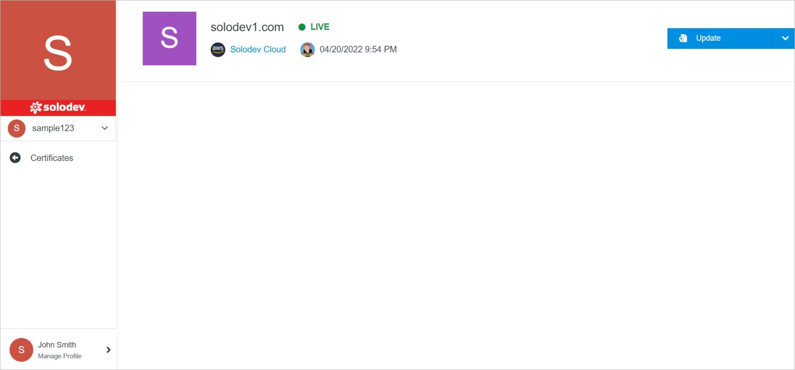

# Certificate Overview

Certificate Overview provides you with the ability to manage your certificates, update details and modify permissions for members.

</a>

**Name** | **Description** 
:--- | ---
<a href="update/">Update</a> | Edit provider settings, delete the certificate.
<a href="permissions/">Permissions</a> | Manage your permissions.
