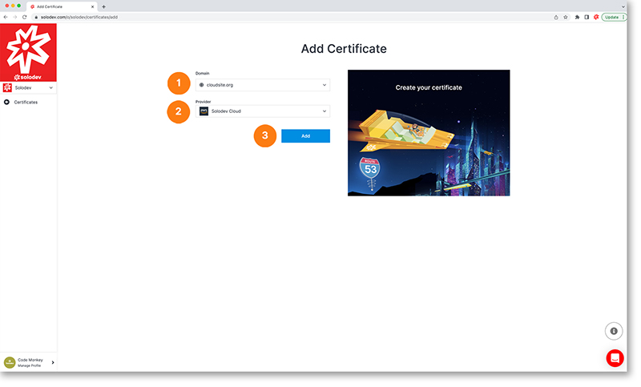

# Add Certificate

The add certificate page allows you to add a certificate to your project.

1. Choose a domain from the drop-down list or select the add donain option
2. Choose a provider from the drop-down list or select the add provider option
3. Click the blue add button to add your new certificate

	
	