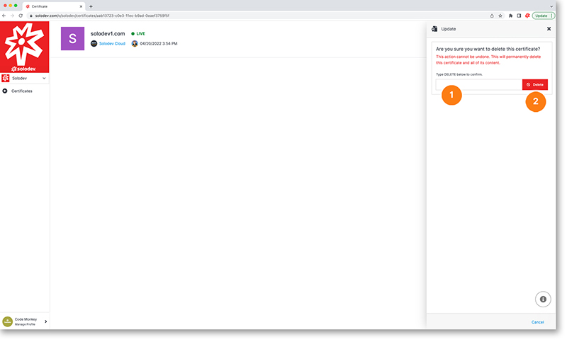

# Delete Certificate

The update certificate modal allows you to delete your certificate

1. Type DELETE in all caps
2. Hit the red Delete button to delete your certificate (this will permanently delete this certificate)
	

