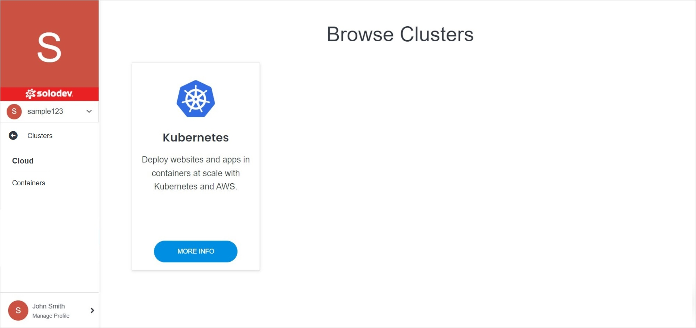
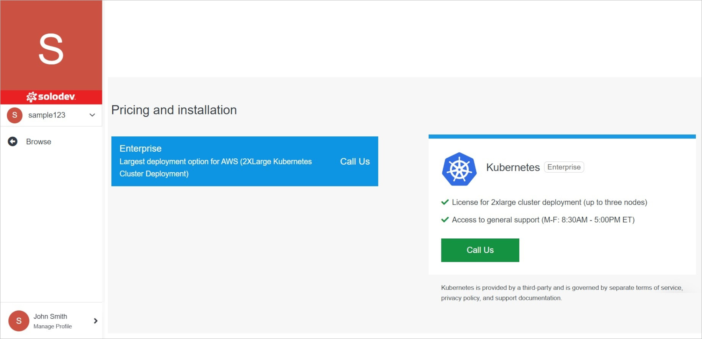

# Add Cluster

Adding a cluster in Solodev Cloud is a simple process, and can be completed in minutes by following the steps below.

</a>

**Name** | **Description** 
:--- | ---
Cluster Selection | Select the cluster you are interested in by clicking on the button on the product card.

!!!Note:
Some products have a purchase option, while to buy others, you need to contact Solodev by filling out the contact form. Below is an example of a product **Kubernetes** that can be can launch only after making a contact with Solodev.
!!!

</a>

**Name** | **Description** 
:--- | ---
Fill out the formular | Click this button to fill out the contact formular.

!!!Note:
The next steps required to install the cluster depend on its specific characteristics.
!!!
