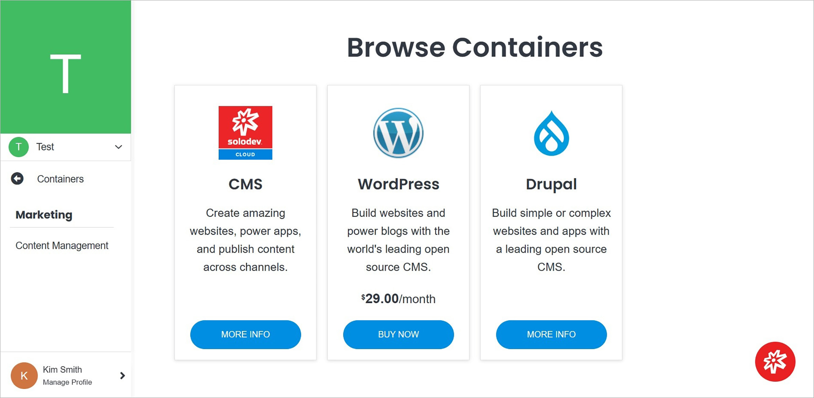

# Add Container

Adding a container in Solodev Cloud is a simple process, and can be completed in minutes by following the steps below.

></a>

**Name** | **Description** 
:--- | ---
Container Selection | Select the container you are interested in by clicking on the button on the product card.

!!!Note:
Some containers have a purchase option, while some are already published in Solodev Cloud and are the contents of someone's catalog, but you can launch them to your Solodev Cloud. Below is an example of the **Apistudio** container that can be launched immediately without having to buy it.
!!!

></a>

**Name** | **Description** 
:--- | ---
Install | Click this button to install the container.

!!!Note:
The next steps required to install the container depend on its specific characteristics.
!!!
