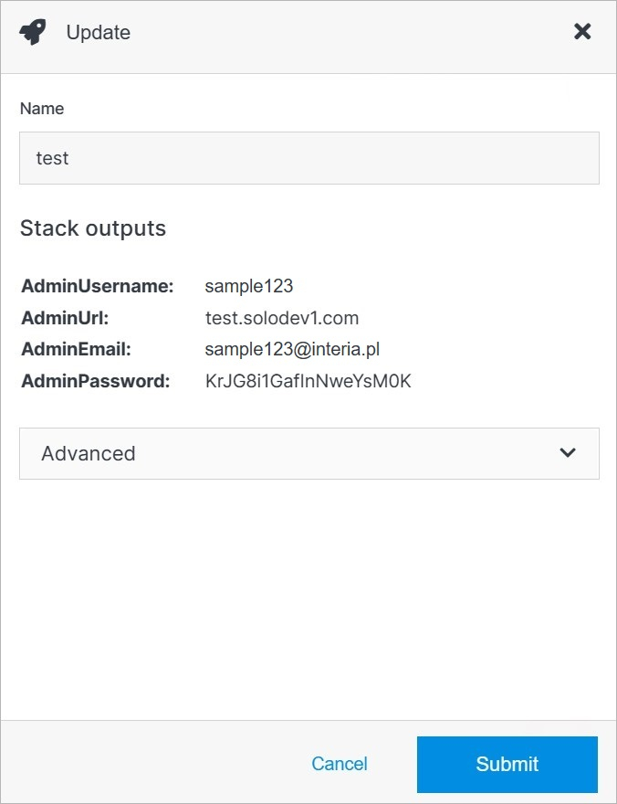

# Update

Update a container's details or delete a container from your Solodev Cloud by clicking the **Update** button on the Container Overview page.

</a>

## Advanced

Under the Advanced dropdown, you can execute advanced operations such as deleting a container. 

</a>

**Name** | **Description** 
:--- | ---
Delete | To remove the container, type **DELETE** in all caps into the field and click the red Delete button.

!!! Note:
Deleting a container will permanently remove the container and all of its content and cannot be undone.
!!!

## Confirm

Once you have completed all the fields, click **Submit** to apply your changes.

