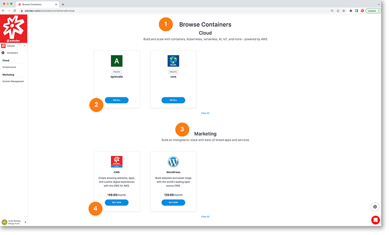

# Add Container

Here you can browse through an assortment of containers. They are organized by category.

1. Containers organized by cloud category
2. Click on the install button to begin the process of adding the container
3. Containers organized by marketing category
4. Click on the buy now button to begin the process of adding the container

