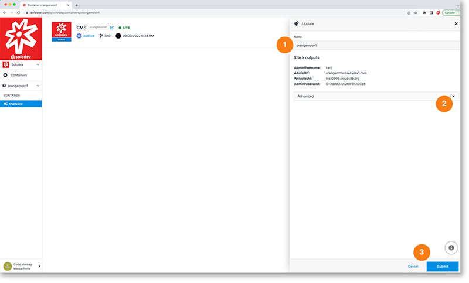

# Update or Delete Container

Updating your container in the modal gives you a few options.

1. Your domain name shows here but is not editable within Solodev
2. You can delete your domain by clicking on the drop-down and following the instructions
3. Click the blue submit button to apply your changes

