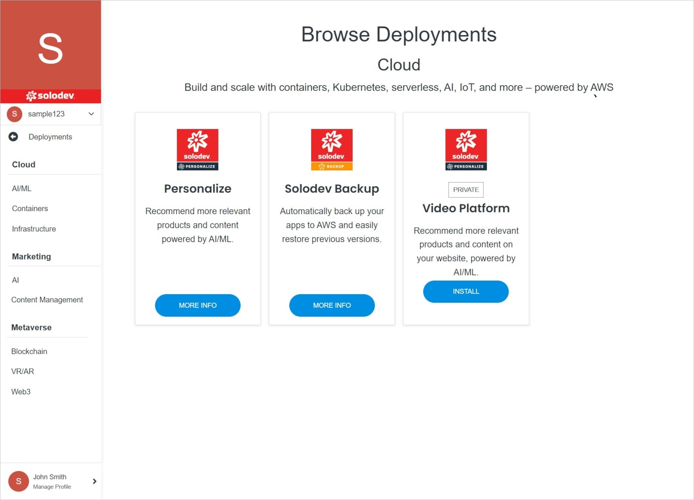

# Add Deployment

Adding a deployment in Solodev Cloud is a simple process, and can be completed in minutes by following the steps below.

</a>

**Name** | **Description** 
:--- | ---
Deployment Selection | Select the deployment you are interested in by clicking on the button on the product card.

!!!Note:
Some deployments have a purchase option,  while to buy others, you need to contact Solodev by filling out the contact form. Some are also already published in Solodev Cloud and are the contents of someone's catalog, but you can launch them to your Solodev Cloud. Below is an example of the **Video Platform** deployment that can be launched immediately without having to buy it or contact Solodev.
!!!

</a>

**Name** | **Description** 
:--- | ---
Install | Click this button to install the deployment.

!!!Note:
The next steps required to install the deployment depend on its specific characteristics.
!!!
