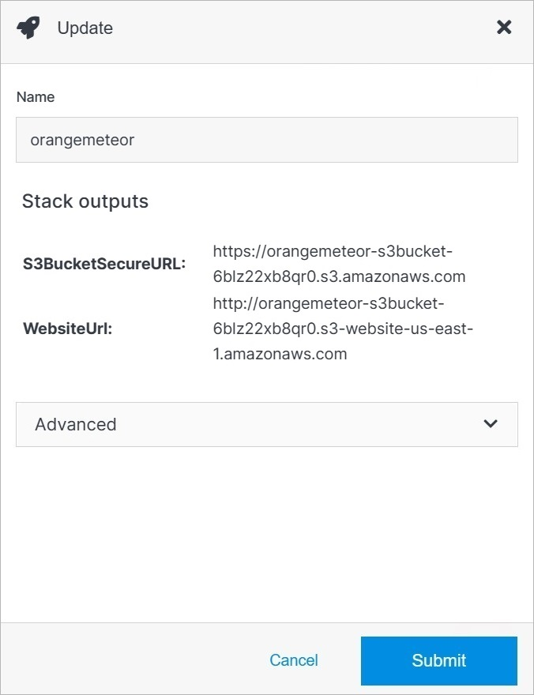

# Update

Update a deployment's details or delete a deployment from your Solodev Cloud by clicking the **Update** button on the Deployment Overview page.

</a>

## Advanced

Under the Advanced dropdown, you can execute advanced operations such as deleting a deployment. 

</a>

**Name** | **Description** 
:--- | ---
Delete | To remove your deployment, type **DELETE** in all caps into the field and click the red Delete button.

!!! Note:
Deleting a deployment will permanently remove the deployment and all of its content and cannot be undone.
!!!

## Confirm

Once you have completed all the fields, click **Submit** to apply your changes.

