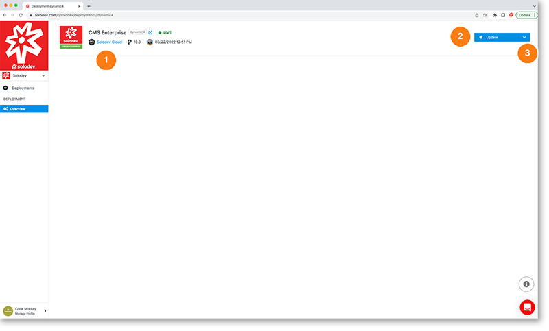

# Deplopyment Details

The deployment detail page shows you important deployment details as well as the ability to update your deployment.
1. Relevant deployment details shown here including:
    a. Deployment type
    b. Deployment name
    c. Deployment status
    d. Deployment provider
    e. Version
    f. Modified date and time
2. Click on the update button to modify your deployment or delete your deployment
3. Click on the drop-down menu to upgrade your deployment or modify permissions

