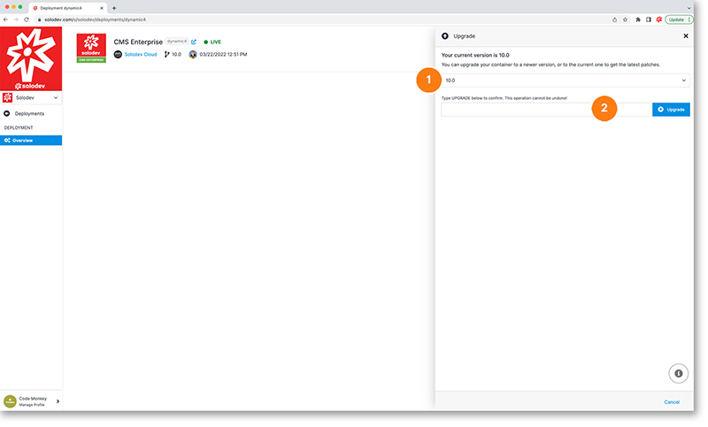

# Upgrade Deployment

You can upgrade your deployment to a new version or simply update to the latest version in the deployment modal:

1. Select the version from the drop-down
2. Type UPGRADE in all caps and hit the blue upgrade button to upgrade your deployment (if you do not want to upgrade hit the blue cancel button in the bottom right)

	