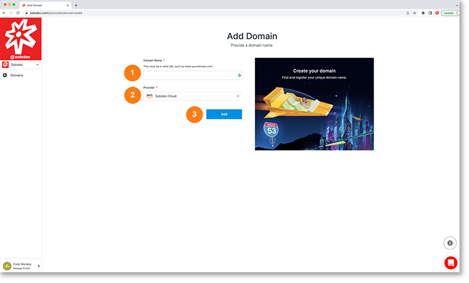

# Add Domain

The add domain page allows you to add a domain to your project.

1. Enter your valid domain name
2. Choose a provider from the drop-down menu or click add provider to add a new one
3. Click the blue add button to add your new domain

